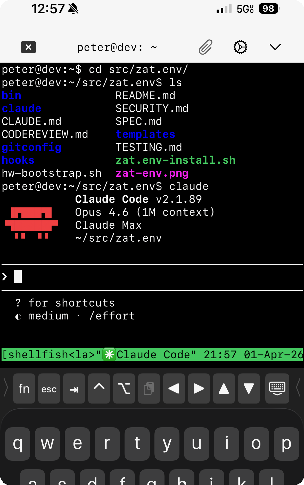

# zat.env

<div align="center">
  
  <br>
  <sub>Claude Code on an iPad (ShellFish), connected via Tailscale SSH to a Linux server in Germany</sub>
</div>

<br>

Reproducible framework for autonomous agentic coding with spec-driven development and adversarial guardrails. Clone this repo and run `zat.env-install.sh` to get specification, adversarial code review, security auditing, architecture review, test strategy review, and a GitHub PR workflow as Claude Code skills, with a pre-push hook that gates `git push` on passing review.

Everything is reproducible from two scripts: `hw-bootstrap.sh` provisions a bare server, `zat.env-install.sh` wires the agentic layer onto any machine. Skills are Markdown prompt files, hooks are bash scripts, conventions are plain text. Full recovery from bare metal is two scripts and a reboot.

**Where this is headed.** Today, zat.env provides best practices for supervised Claude Code usage: spec-driven development, adversarial review gates, and minimal conventions that stay out of the model's way. The design is deliberately minimal because current and future Anthropic coding models are good enough that over-specializing the harness limits your ability to benefit from model improvements. Over time, the goal is to layer autonomous coding loops on top of this foundation (review/fix/review cycles, convergence detection, parallel agents on branches) while keeping the harness as simple as the models allow. See [Roadmap](#roadmap) for the progression.

<a id="spec-driven-iteration"></a>

**Spec-driven iteration.** Agents without concrete acceptance criteria drift. They optimize for making tests pass rather than solving the problem, and "works but not good enough" stays vague indefinitely. The spec is what keeps the agent (and the human) oriented: it defines what done looks like, gives review skills something to verify against, and lets a fresh session re-orient from disk without stale context. This loop is how you actually build things with zat.env, whether supervised or autonomous:

1. `/spec` (or `/spec <description>`) to define acceptance criteria
2. "Implement the spec" and let Claude work. Intervene with manual direction as needed.
3. `/spec` again to check off completed criteria (evolve mode)
4. Repeat 2-3 until all criteria are met
5. `/spec` again to define the next unit of work. If the result works but quality is not where you want it, say so: "/spec the feature is complete but the output is still rough, build a plan to improve quality over time." This produces a new SPEC.md with criteria targeting specific quality dimensions, and the cycle repeats.

Each pass through the loop tightens quality. The spec is what prevents drift across sessions, what gives review skills a contract to verify against, and what makes "improve quality" a concrete, trackable activity rather than a vague aspiration. (See [Philosophy](#philosophy) for the design principles behind this.)

## Contents

- [Quick Start](#quick-start)
  - [What the install script does](#what-the-install-script-does)
- [Daily Workflow](#daily-workflow)
  - [Connecting](#connecting)
  - [Starting a project](#starting-a-project)
  - [tmux and persistent sessions](#tmux-and-persistent-sessions)
  - [zatmux](#zatmux)
- [Agentic Skills](#agentic-skills)
  - [Prompt Design Principles](#prompt-design-principles)
  - [`/spec`: Specification](#spec-specification)
  - [`/codereview`: Adversarial Code Review](#codereview-adversarial-code-review)
  - [`/security`: Security Review](#security-security-review)
  - [`/architect`: Architecture Review](#architect-architecture-review)
  - [`/tester`: Test Strategy Review](#tester-test-strategy-review)
  - [`/pr`: Pull Request Workflow](#pr-pull-request-workflow)
  - [Pre-Push Gate](#pre-push-gate)
  - [Severity Model](#severity-model)
  - [Persistent Review Files](#persistent-review-files)
  - [Cross-Skill Reading DAG](#cross-skill-reading-dag)
- [Coding Practices](#coding-practices)
- [Philosophy](#philosophy)
- [Theory of Autonomous Improvement](#theory-of-autonomous-improvement)
  - [The Carlini Principle](#the-carlini-principle)
  - [Why Agents Can't One-Shot Complex Projects](#why-agents-cant-one-shot-complex-projects)
  - [The Autonomy Spectrum](#the-autonomy-spectrum)
  - [Anti-Patterns We Designed Against](#anti-patterns-we-designed-against)
- [Current Hardware: Hetzner GEX44](#current-hardware-hetzner-gex44)
  - [Machine Specs](#machine-specs)
  - [Setup From Scratch](#setup-from-scratch)
  - [Directory Overview](#directory-overview)
- [References](#references)
- [Roadmap](#roadmap)

---

## Quick Start

```bash
git clone git@github.com:peterzat/zat.env.git ~/src/zat.env
~/src/zat.env/zat.env-install.sh
# Restart Claude Code to pick up skills and hooks
```

This installs on any machine with git, jq, and Claude Code. It symlinks skills into `~/.claude/skills/`, wires the pre-push hook into `~/.claude/settings.json`, and sets up git config. Safe to re-run at any time.

**No hardcoded identity.** Git `user.name` and `user.email` are not stored in this repo. The install script prompts on first run and reuses the existing git config on subsequent runs. Override with `GIT_NAME=x GIT_EMAIL=y@z ./zat.env-install.sh`.

**Generated review files.** `CODEREVIEW.md`, `SECURITY.md`, `TESTING.md`, and `SPEC.md` in downstream project roots are produced by running `/codereview`, `/security`, `/tester`, and `/spec`. The skills that generate them live in `claude/skills/`. These files are working state, not documentation, and should be committed alongside the code they describe.

### What the install script does

The repo stays at `~/src/zat.env/` and remains part of the live system after install. Most configuration is symlinked rather than copied, so the repo and the active config are the same files.

**Symlinked into `~/.claude/` (live, `git pull` updates them immediately):**
- `~/.claude/CLAUDE.md` -> `claude/global-claude.md`
- `~/.claude/skills/spec/` -> `claude/skills/spec/`
- `~/.claude/skills/codereview/` -> `claude/skills/codereview/`
- `~/.claude/skills/security/` -> `claude/skills/security/`
- `~/.claude/skills/architect/` -> `claude/skills/architect/`
- `~/.claude/skills/tester/` -> `claude/skills/tester/`
- `~/.claude/skills/pr/` -> `claude/skills/pr/`

**Registered as paths into the repo (live, `git pull` updates the content, no re-install needed):**
- `~/.gitconfig` gets `include.path` pointing at `gitconfig/aliases.gitconfig` and `core.excludesfile` pointing at `gitconfig/ignore-global`
- `~/.claude/settings.json` gets a pre-push hook entry with the path to `hooks/pre-push-codereview.sh`
- `~/.claude/settings.json` gets a permissions block (defaultMode, allow list for common dev commands, deny list for dangerous patterns). This block is replaced on each install to prevent session-accumulated cruft.

**Re-run `zat.env-install.sh` when:**
- A new skill is added to `claude/skills/` (the symlink for the new skill won't exist yet)
- A new hook is added to `hooks/` (it won't be registered in `settings.json` yet)
- The repo is moved to a different path (all registered paths need updating)

**Updating:**
```bash
cd ~/src/zat.env && git pull
# Re-run install only if new skills or hooks were added:
./zat.env-install.sh
```

---

## Daily Workflow

### Connecting
```bash
ssh peter@dev
# or: ssh peter@dev.emperor-exponential.ts.net
# or from phone via any SSH client (ShellFish, Termius, etc.)
```

### Starting a project
```bash
# Clone an existing repo and open a persistent claude session
ccproj myrepo git@github.com:peterzat/myrepo.git

# Create a new project from scratch
newproj my-new-thing
```

### tmux and persistent sessions
`~/src/` is just a directory. You can clone or create repos there however you like. `ccproj` and `newproj` are specifically for when you want a **persistent named terminal session** tied to a project.

When you run `ccproj ranking ...`:
1. The repo is cloned to `~/src/ranking`
2. A tmux session named `ranking` is created with `claude` running inside it
3. If you disconnect (SSH drop, laptop closes), the session keeps running. Claude keeps coding.

Come back later with:
```bash
projattach ranking      # reattach to the ranking session
projls                  # see all running sessions
```

### zatmux

Tmux session toggle. Attach from outside tmux, detach from inside:

```bash
cd ~
zatmux                  # attach or create the "shellfish-1" session
zatmux                  # (inside tmux) detach

cd ~/src/ranking
zatmux                  # attach or create a "ranking" session
zatmux                  # (inside tmux) detach
```

Designed around ShellFish (iOS SSH client), which auto-creates a tmux session called `shellfish-1`. Running `zatmux` from `~/` gets you into that session whether it already exists or not. Running it again from inside any tmux session detaches cleanly without killing the session. New sessions get a plain shell (use `ccproj`/`newproj` if you want Claude to launch automatically).

---

## Agentic Skills

Global skills are installed by `zat.env-install.sh` and available in all Claude Code sessions. Each skill runs as a forked subagent with its own context window, starts from scratch, and gathers everything it needs from the codebase. Full instructions live in `claude/skills/<name>/SKILL.md`.

| Skill | Command | Invocation | Purpose |
|-------|---------|------------|---------|
| Spec | [`/spec`](claude/skills/spec/SKILL.md) | Manual only | Define acceptance criteria before implementation |
| Code Review | [`/codereview`](claude/skills/codereview/SKILL.md) | Auto (pre-push) + manual | Adversarial review of uncommitted changes |
| Security | [`/security`](claude/skills/security/SKILL.md) | Manual + chained from codereview | Security audit (full repo or changes-only) |
| Architect | [`/architect`](claude/skills/architect/SKILL.md) | Manual only | Strategic architecture review (10 dimensions, HEALTHY/WATCH/ACT) |
| Tester | [`/tester`](claude/skills/tester/SKILL.md) | Manual only | Test strategy assessment |
| Pull Request | [`/pr`](claude/skills/pr/SKILL.md) | Manual only | Create, inspect, or merge GitHub PRs |

### Prompt Design Principles

All skills share a set of prompt design principles informed by community research on AI code review agents. These principles are embedded directly in each SKILL.md:

- **Precision over recall.** Every false positive wastes human attention. Skills only report findings they have high confidence in.
- **Evidence grounding.** Every finding must cite a specific file and line. If the finding depends on code outside the diff, the skill must read that code first. No speculation about unverified behavior.
- **Halt on uncertainty.** Below 80% confidence, the skill omits the finding or flags it as uncertain. Guessing is worse than silence.
- **Empty report is valid.** A clean report means the code is clean. Skills never manufacture findings to fill a template.
- **No style policing.** Formatting, naming, and aesthetic preferences are not findings unless they indicate a functional or structural problem.
- **Scoped context reads.** When reading persistent files from prior runs, skills focus on the most recent entry, unresolved BLOCKs, and the metadata footer. Historical entries older than the current branch's base commit are skipped.

These principles address the most common failure mode of AI review agents: generating noise that erodes trust. Industry experience with AI code review tools consistently shows that precision-biased instructions (focus on logic and security, not style) dramatically improve developer action rates on AI-generated findings.

Beyond content-level instructions, skills use Claude Code's `effort` frontmatter field to match reasoning depth to task criticality. `/spec`, `/codereview`, `/security`, and `/architect` all set `effort: high` in their frontmatter, which tells the harness to use high-effort adaptive reasoning for the entire skill execution. Each of these skills also includes a structured pressure-test step after analysis but before writing findings, verifying that conclusions are grounded and severity levels are calibrated. Convention files like `global-claude.md` describe the same analytical rigor as a behavioral norm, so routine turns outside skills are not over-indexed.

### [`/spec`](claude/skills/spec/SKILL.md): Specification

**Persona:** Principal Product Manager.

**Trigger:** Manual only (`/spec`). Not auto-invoked.

**What it does:**

Defines what done looks like before implementation begins. The output is `SPEC.md`: a verification contract with concrete acceptance criteria that an agent or human can check off. The value of a spec is the acceptance criteria. Everything else (numbered requirements, phased task lists, Given/When/Then ceremony) is optional and only added if the user asks for it.

Three modes:
- **Interview mode** (`/spec new` or first run): asks the user focused questions about goals and acceptance criteria, then writes SPEC.md
- **Direct mode** (`/spec <description>`): reads the codebase, proposes acceptance criteria for the described feature, confirms with the user
- **Evolve mode** (`/spec` with existing SPEC.md): assesses progress against current criteria, reports which are met, and helps define the next unit of work

`SPEC.md` uses the same rolling format as other persistent files: current entry, one-line prior summary, structured metadata footer (`<!-- SPEC_META: {...} -->`). Each entry covers one unit of work, not the entire project.

**Framework-informed context.** `/spec` reads the zat.env README in addition to the project's own files. Relevant philosophy, coding practices, anti-patterns, and design principles are extracted and carried into SPEC.md's Context section, so the coding agent has them available during implementation without needing to read zat.env itself. This is selective, not wholesale: only points relevant to the specific unit of work are included.

**Pressure test.** When writing new acceptance criteria (interview, direct, or post-completion evolve mode), a structured pressure-test checkpoint reviews drafted criteria for missing edge cases, unstated assumptions, unspecified failure behavior, and over-specification before writing SPEC.md. This step is skipped for routine evolve-mode check-offs where criteria are unchanged. The skill runs at `effort: high` via frontmatter to ensure deep reasoning across all steps.

**What it does NOT do:** generate code, write tests, or run the test suite. It defines the contract. Implementation follows separately.

**Typical workflow:**
1. Run `/spec` (or `/spec <description>`) to define acceptance criteria before starting work
2. Implement normally. `/codereview` checks spec alignment as part of its review.
3. When you think you're done, run `/spec` again. It enters evolve mode: reads the codebase, assesses which criteria are met, checks them off in SPEC.md, and updates the metadata footer.
4. When all criteria are met, `/spec` summarizes completion and asks what the next unit of work is. The cycle repeats.

For external or cloned projects, SPEC.md describes what you are building or changing right now, not what the project is (that's README territory).

**Design intent.** Agents without acceptance criteria optimize for "make tests pass" rather than "solve the problem." In autonomous loops, the spec is the artifact that answers "what should I be building?" when the agent starts a fresh session. All review skills read SPEC.md when it exists: `/codereview` checks spec alignment, `/tester` checks whether tests cover the criteria, `/architect` evaluates whether the architecture can support the criteria, `/security` uses the spec for scope awareness.

### [`/codereview`](claude/skills/codereview/SKILL.md): Adversarial Code Review

**Persona:** Principal Software Engineer, adversarial stance.

**Trigger:** Runs automatically before any `git push` (via the pre-push hook gate). Also invocable manually.

**Tiered review.** After gathering the diff, the skill classifies changes as **light** (docs/config only: `.md`, `.json`, `.yaml`, etc.) or **full** (any code files). Light review skips the test suite, security chain, auto-fix loop, and fix verification. This keeps doc-only pushes fast while maintaining the full pipeline for code changes.

**Refresh review optimization.** When a prior CODEREVIEW.md exists with `block: 0` and the reviewed commit is an ancestor of HEAD, the skill performs an incremental review scoped to files changed since the prior review. This keeps iterative fix-and-review cycles fast without re-evaluating the entire diff.

**Full review pipeline:**
1. Reads prior review state from CODEREVIEW.md, SECURITY.md, TESTING.md, and SPEC.md (scoped reads)
2. Checks for a prior successful review (refresh detection); if eligible, scopes to changed-since files only
3. Gathers all uncommitted/staged changes via `git diff`; reads full changed files for context
4. Classifies review tier (light or full)
5. Runs the project's test suite (if one exists) to capture a baseline
6. Reviews for correctness, code quality, solution approach, spaghetti detection (mixed concerns in one commit), regression risk, and spec alignment (if SPEC.md exists)
7. Chains to `/security changes-only` for a focused security review of the same diff. If no code files changed since the prior security scan, carries forward existing findings instead of re-invoking the security skill.
8. Reports findings as BLOCK / WARN / NOTE with evidence citations
9. Auto-fixes BLOCK and WARN items with **escalating conservatism**: iteration 1 fixes normally (one issue at a time, max 20 lines per fix); iteration 2 requires explaining why the prior fix failed before retrying; iteration 3 stops and reports to the human
10. Re-runs tests after fixing; reverts any fix that causes test regression
11. Writes a content-addressed marker file so the pre-push hook allows the next `git push`
12. Updates `CODEREVIEW.md` with a dated entry and structured metadata footer

**Pressure test (full review only).** After evaluating all review dimensions and before writing findings, a structured pressure-test checkpoint verifies bugs are confirmed rather than suspected, checks that regression risk claims trace actual callers, filters style-as-substance false positives, and reconsiders solution approach. Skipped for light reviews. The skill runs at `effort: high` via frontmatter.

**Key guard:** Never deletes, skips, or weakens existing tests to make them pass. Fixes the code, not the tests.

### [`/security`](claude/skills/security/SKILL.md): Security Review

**Persona:** Principal Security Engineer.

**Trigger:** Manual invocation, or chained automatically from `/codereview`.

**Scope:** Controlled via arguments. `/security` reviews the full repo. `/security changes-only` focuses on the current diff. `/security path/to/file` reviews a specific file.

**What it does:**
1. Reads prior security state from SECURITY.md, CODEREVIEW.md, and SPEC.md (scoped reads)
2. Scopes the review based on arguments
3. Reviews across 8 dimensions: secret leaks (including git history), input/output sanitization (with data flow tracing), auth/authz, dependency supply chain, infrastructure security, AI-specific risks (prompt injection, unvalidated LLM output), data exposure, and PII in source
4. Reports findings with concrete attack vectors. "An attacker could theoretically..." without specifying how they reach the code path is not a finding.
5. Updates `SECURITY.md` with dated findings, resolved/open status, and accepted risks

**Pressure test.** Before writing findings, a structured pressure-test verifies attack vectors are reachable (not assumed), rechecks dimensions where nothing was found, calibrates severity levels, and confirms git history was checked for leaked secrets. The skill runs at `effort: high` via frontmatter.

### [`/architect`](claude/skills/architect/SKILL.md): Architecture Review

**Persona:** Senior Architecture Review Board.

**Trigger:** Manual only (`/architect`). Not auto-invoked. Supports focused deep-dives: `/architect deps`, `/architect ops`, `/architect <topic>`.

**What it does:**
1. Reads all four persistent files (CODEREVIEW.md, SECURITY.md, TESTING.md, SPEC.md)
2. Explores the codebase: README, directory structure, languages, frameworks, entry points, dependency manifests, CI/CD configs, onboarding docs
3. Evaluates 10 dimensions in two groups:
   - **Design Quality:** structural clarity, appropriate complexity, scale alignment, dependency health (includes outdated packages, license risks, bloat, upgrade paths, vendor lock-in), extensibility
   - **Strategic Fitness:** consistency, business goal alignment, technology selection, operational fitness, developer experience
4. Reports per dimension with HIGH / MEDIUM / LOW priority, or "Nothing to flag"
5. Produces a Strategic Summary with a board recommendation: HEALTHY / WATCH / ACT
6. Produces no persistent file (terminal node; see [Cross-Skill Reading DAG](#cross-skill-reading-dag))

**Pressure test.** Six pressure-test questions recalibrate assessments against the project's actual scale and goals, verify that complexity concerns name concrete costs, check extensibility recommendations against evidence of anticipated changes, distinguish transitional inconsistency from architectural drift, require evidence of friction before recommending technology changes, and calibrate operational expectations to the deployment model. The skill runs at `effort: high` via frontmatter.

**"No strategic concerns at this time"** is a valid and expected outcome. Most codebases have sound architecture.

### [`/tester`](claude/skills/tester/SKILL.md): Test Strategy Review

**Persona:** Principal Software Design Engineer in Test (SDE/T).

**Trigger:** Manual only (`/tester`). Not auto-invoked.

**What it does:**
1. Reads prior assessment from TESTING.md, SECURITY.md, CODEREVIEW.md, and SPEC.md (scoped reads)
2. Discovers test infrastructure: test files, frameworks, CI/CD configs, coverage tools, pre-commit hooks, deployment configs
3. Evaluates 8 dimensions: test coverage strategy (are the right things tested?), automation maturity, automatic test execution (tests that must be run manually are often not run), CI/CD integration, framework choices, fixture management, flaky test patterns, and missing test categories
4. Reports findings as BLOCK / WARN / NOTE. Does not write or run individual tests.
5. Updates `TESTING.md` with dated assessment and status of prior recommendations

**"This is fine for now"** is valid. A new prototype with a few pytest files and no CI is fine. A production API with no integration tests is not. The assessment is always proportional to the project's maturity and goals.

### [`/pr`](claude/skills/pr/SKILL.md): Pull Request Workflow

**Trigger:** Manual only (`/pr`). Not auto-invoked.

**What it does:**

Five modes dispatched by argument:

- `/pr` or `/pr <branch-name>` -- create a PR. If on `main`, creates a feature branch:
  when a branch name is given, uses it with an appropriate prefix (`feat/`, `fix/`, `docs/`);
  when no branch name is given, derives one from the commit message (lowercased, hyphenated,
  with the same prefix convention). Checks for an existing PR on the branch (idempotent;
  will not create duplicates). Composes the title from commit messages (single commit: uses
  the commit message; multiple commits: writes a concise summary under 70 chars) and the
  body from review file metadata.
- `/pr status` -- show the current branch's PR state, CI checks, and merge readiness
- `/pr <number>` -- inspect a specific PR and summarize review comments
- `/pr merge` -- verify the codereview marker, then `gh pr merge --squash --delete-branch`
  and return to main
- `/pr list` -- list open PRs for the repo

**Auto-composed PR descriptions.** The skill reads metadata footers from CODEREVIEW.md,
SECURITY.md, TESTING.md, and SPEC.md to populate a review status table and spec summary
in the PR body. Review files written by other skills become the PR description with no
extra work.

**Review gate on merge.** `/pr merge` performs the same diff-hash check as the pre-push
hook. A PR cannot be merged through this skill without a passing `/codereview`.

**Design intent.** Right now, `/pr` is primarily a convenience for composing PR descriptions
and running `gh pr create`. Direct-to-main remains the default solo workflow, and PRs are
opt-in. The longer-term purpose is to establish PRs as the coordination primitive for
autonomous agent loops (see [The Carlini Principle](#the-carlini-principle)). Terminal node
in the reading DAG: reads review metadata, produces no persistent file.

### Pre-Push Gate

A Claude Code `PreToolUse` hook (configured in `~/.claude/settings.json`) intercepts every `git push` command. The push is blocked unless `/codereview` has been run and passed on the current diff.

**Flow:**
1. Claude attempts `git push`
2. Hook reads the JSON payload from stdin and checks if the command is `git push`
3. Hook checks for a marker file at `/tmp/.claude-codereview-<project-hash>`
4. Marker contains the diff hash (first 16 chars of `git diff HEAD | sha256sum`) from the passing review. This makes the marker content-addressed: it's tied to the exact diff that was reviewed, not just "some review happened."
5. If marker exists and hash matches current diff, push proceeds; marker is deleted
6. Otherwise, push blocked; Claude instructed to run `/codereview`

The marker is per-project (scoped by git root path hash) and single-use. Making new changes after a passing review requires a new review before the next push.

**"Push now" bypass.** Say "push now" to skip codereview for a single push. Claude creates a one-time bypass marker and pushes immediately. Useful for docs-only or trivial changes where the full review pipeline is overkill.

### Severity Model

All skills use a consistent three-level severity model:

| Level | Meaning | Action |
|-------|---------|--------|
| **BLOCK** | Must fix before pushing / shipping | Auto-fixed by codereview; others report to human |
| **WARN** | Should fix; significant gap | Auto-fixed by codereview; others report to human |
| **NOTE** | Informational; improvement opportunity | Reported only, never auto-fixed |

### Persistent Review Files

Four skills write per-project files to the project root. These files are working state, not documentation. They serve as inter-session memory: each skill invocation reads relevant files to avoid re-reporting resolved issues and to track whether recommendations were adopted. Each file ends with a structured metadata comment (e.g., `<!-- REVIEW_META: {...} -->`) that enables future tooling for convergence detection and trending.

| File | Written by | Contents |
|------|-----------|----------|
| `SPEC.md` | `/spec` | Current acceptance criteria, goal, context |
| `CODEREVIEW.md` | `/codereview` | Dated review history, findings, fixes applied |
| `SECURITY.md` | `/security` | Security findings, resolved issues, accepted risks |
| `TESTING.md` | `/tester` | Test strategy assessment, recommendation status |

### Cross-Skill Reading DAG

Skills read each other's persistent files in a directed acyclic graph to prevent amplification loops:

```
                    SPEC.md (upstream of all review skills)
                       |
                       v
spec        -> writes SPEC.md (reads CODEREVIEW.md, TESTING.md for context)
codereview  -> reads SPEC.md, SECURITY.md, TESTING.md
security    -> reads SPEC.md, CODEREVIEW.md
tester      -> reads SPEC.md, SECURITY.md, CODEREVIEW.md
architect   -> reads all four (terminal node, produces no persistent file)
pr          -> reads all four metadata footers (terminal node, produces no persistent file)
```

SPEC.md sits upstream of all review skills as the intent declaration. Review skills read it to check alignment, coverage, and scope, but never modify it. Architect and pr are terminal nodes: their output informs human decisions and does not feed back into automated review. This prevents recommendations from becoming automatic codereview criteria without deliberate human adoption.

---

## Coding Practices

These instructions are embedded in [`claude/global-claude.md`](claude/global-claude.md) and active in every Claude Code session on this machine. They are the operational translation of the philosophy above into day-to-day coding behavior.

- Work in small, committable increments. Get one thing working before adding the next. Do not build scaffolding for features that are not needed yet.
- Before implementing changes, verify the project builds and existing tests pass. Fix pre-existing failures before adding new work.
- When adding or changing functionality, write or update tests in the same increment. If the project has no test infrastructure, add a minimal test runner first.
- Run the test suite (or the relevant subset) after each functional change. Do not stack multiple untested changes.
- When fixing a bug, change only what is necessary. Do not refactor surrounding code or improve unrelated code in the same change.
- If a change causes previously passing tests to fail, revert it and try a different approach. Do not modify tests to accommodate a regression.
- If two consecutive fix attempts fail, stop, revert to the last working state, and re-evaluate the approach.
- Before switching tasks or when context grows large, write key decisions and current state to a file (commit message, README, or project-specific doc). Prefer restarting with a written plan over continuing with a long, stale context.


These practices are deliberately minimal. Shorter, more specific instructions outperform comprehensive ones for AI agents: as instruction volume grows, compliance with any single instruction drops (instruction dilution). Each bullet targets a specific failure mode that agents cannot reliably self-correct without explicit guidance. If a practice can be enforced by tooling (linting, hooks, tests), it belongs in tooling, not here.

---

## Philosophy

**Claude Code as the primary development tool.** This environment is built for long autonomous coding sessions where Claude reviews its own work, fixes issues, and iterates. Skills, hooks, and conventions provide the structure: adversarial review before pushing, quantitative signals to detect convergence, and circuit breakers to cap runaway loops.

**Always-on, never a snowflake.** Long agentic loops need an always-reachable machine: sessions that survive SSH disconnects, overnight jobs that keep running, an environment tuned for the work. But a hand-configured machine is a liability. Everything must be reproducible: `hw-bootstrap.sh` provisions bare metal, `zat.env-install.sh` installs the agentic layer, and the combination recovers the full environment from scratch. Any hardware that meets the minimum spec and is reachable via Tailscale works.

**Verification over prompting.** The quality of automated verification determines the ceiling of what agents can build. A well-designed test suite and review loop is worth more than a better prompt. See [The Carlini Principle](#the-carlini-principle) for the background.

**Spec is code.** For agentic coding, a spec is not documentation. It is the verification contract that defines what done looks like. Without acceptance criteria, agents optimize for passing tests rather than solving the problem. A well-written acceptance criterion is worth more than a well-written prompt, because it tells the agent (and the review loop) what to verify. SPEC.md sits upstream of all review skills: codereview checks spec alignment, tester checks criteria coverage, architect evaluates whether the architecture serves the spec's goals. In autonomous loops, the spec is what lets a fresh agent session re-orient from disk and pick up where the last session left off.

**Precision over recall.** False positives erode trust in automated review faster than false negatives. Every review skill is designed to stay silent when it has nothing to say. "No issues found" is the correct and expected outcome for quality code.

**Elements of autonomy.** Four things work together to enable long-running coding loops without human intervention per-cycle: adaptive reasoning effort (`effort: high` frontmatter on review and spec skills ensures deep analysis at critical decision points), spec-driven development (concrete acceptance criteria that tell the agent what to build and when it is done), role-based agents (skills with distinct personas that review, verify, and gate each other's work), and artifact-based memory (SPEC.md, CODEREVIEW.md, SECURITY.md, TESTING.md are checked into git and survive across sessions, so a fresh agent can re-orient from disk). Remove any one element and the loop degrades: without specs, agents drift; without review agents, quality drops; without artifacts, sessions lose continuity; without effort control, critical analysis is shallow.

**Autonomy spectrum.** Start supervised (Claude proposes, human reviews). Grow toward autonomous operation with guardrails: adversarial review skills, pre-push hook gates, structured constraints.

**Portable by design.** This setup is coupled to Claude Code and Ubuntu Linux, both first-rate for agentic workloads. Beyond those two choices, everything is portable: skills are Markdown, hooks are bash, conventions are plain text. If Claude Code gains a serious competitor or a different model pulls ahead, the work to port is swapping skill invocation syntax and hook registration, not rethinking the architecture.

**Grow incrementally.** Start simple. Add complexity only when earned by real use cases.

**Improvements flow upstream.** zat.env is a shared, evolving system. Skills, hooks, and conventions are symlinked into every project, so improvements compound across all current and future work. When a downstream project reveals a skill gap, prompt issue, or missing convention, the fix is made in the zat.env repo, never patched locally in a downstream project. The feedback loop: stop, note the issue, switch to zat.env to make the fix, return to the downstream project. Local patches (per-project memory overrides, inline edits to symlinked files) help one project while the same issue persists everywhere else.

---

## Theory of Autonomous Improvement

This section documents the design philosophy behind the agentic skill system and the long-term vision for autonomous coding loops.

### The Carlini Principle

In February 2026, Nicholas Carlini at Anthropic [built a complete C compiler](https://www.anthropic.com/engineering/building-c-compiler) using 16 parallel Claude Opus 4.6 agents running in an infinite loop. 100,000 lines of Rust, 3,982 commits, ~$20,000 in API costs, 2 weeks. No human wrote code.

Separately, Prithvi Rajasekaran at Anthropic Labs documented [harness design for long-running application development](https://www.anthropic.com/engineering/harness-design-long-running-apps), showing that a generator-evaluator architecture (dedicated planner, generator, and evaluator agents with hard quality thresholds) produces dramatically better results than single-agent runs, even when the single agent is the same model. The key patterns: separate generation from evaluation, make subjective quality measurable with weighted rubrics, and use context resets or compaction to sustain coherence across hours-long sessions.

Together these two papers form the technical basis for the autonomous loop roadmap below. Carlini's work demonstrates that verification loop quality determines output quality. Rajasekaran's work demonstrates how to structure the harness: decompose into specialized agents, stress-test evaluator criteria, and simplify the harness as model capabilities improve.

Applied here: invest in verification (review skills, test suites, feedback loops) before investing in prompts. A well-designed review loop is worth more than a better system prompt.

### Why Agents Can't One-Shot Complex Projects

Even Opus 4.6 cannot reliably one-shot complex projects. This is not a model limitation to be overcome with better prompts or larger context windows. It is a fundamental property of how complexity interacts with sequential decision-making.

**Requirements are underspecified.** Real projects have ambiguity that only surfaces during implementation. "Add authentication" implies dozens of decisions (session lifetime, token storage, error UX, rate limiting) that the requester hasn't articulated and may not have opinions on until they see a working version. An agent making all these decisions at once will get some wrong, and the cost of correcting compound errors is higher than making them incrementally.

**Errors compound non-linearly.** A wrong abstraction chosen in step 3 of 20 doesn't just make step 3 wrong. It warps steps 4 through 20 to fit the bad abstraction. In an iterative loop, the wrong abstraction is caught at step 4 and corrected. In a one-shot run, the agent builds confidently on a flawed foundation because it has no external signal that anything is off.

**Context degrades with scale.** Models attend to everything in context, but not equally. As a one-shot generation grows, early decisions (architecture, naming, module boundaries) get diluted by the volume of later code. The agent loses coherence with its own earlier choices. This is why Rajasekaran's harness design paper emphasizes context resets: sustained coherence requires periodically discarding accumulated context and re-grounding from persistent artifacts.

**Verification requires a different mode than generation.** Generating code and evaluating code exercise different judgment. When the same agent does both in a single pass, it is biased toward confirming its own choices. Carlini's compiler project and Rajasekaran's harness work both show that separating generation from evaluation (even when the same model does both) produces measurably better results.

**Human intent is discovered, not transmitted.** Users refine what they want by reacting to what they see. A one-shot agent denies the user this feedback opportunity. The result may be technically correct and still miss the point, because the point only becomes clear through iteration.

The solution is iterative structure with verification at each step. This system implements the following mitigations:

1. **Regression detection.** The Coding Practices conventions require running tests before and after fixes, and reverting if things get worse. This is enforced by convention in the global prompt, not by automated tooling.
2. **Retry limits.** The convention "if two consecutive fix attempts fail, stop and re-evaluate" prevents the agent from spiraling. This is a prompt-level rule, not a stateful detection mechanism.
3. **Diminishing returns.** Skills are designed to report "nothing to add" when code is clean, rather than generating noise to fill a template.
4. **Machine-readable review metadata.** Review skills emit structured metadata (`<!-- REVIEW_META: {...} -->`) alongside prose findings. This is the foundation for future automated convergence detection but is not yet consumed programmatically.

### The Autonomy Spectrum

```
Supervised          Claude proposes, Peter reviews and approves everything
    |
Gated               Pre-push hook ensures review passes before code leaves the machine
    |
Autonomous          Review skills run in loops; Claude fixes and iterates without interruption
    |
Multi-agent         Parallel Claude sessions across projects with shared verification state
```

The current system is at **Gated**. The skills and persistent files are the foundation for moving to **Autonomous**, where Claude can run `/codereview`, fix issues, and iterate without human intervention per-cycle, while the human reviews outcomes rather than individual steps.

### Anti-Patterns We Designed Against

**False positive factories.** Skills that manufacture findings to fill structured templates. Countered by: explicit precision-over-recall instructions, "no findings is valid" in every skill, evidence grounding requirement.

**Context exhaustion.** Agents that read too much and degrade quality as context fills. Countered by: scoped persistent file reads (most recent entry + BLOCKs + metadata footer only), prioritization of high-risk files for large diffs.

**Circular amplification.** A NOTE becomes a BLOCK through cross-skill contamination (codereview flags something, security escalates it, architect recommends refactor, codereview flags code for not following the recommendation). Countered by: directed acyclic reading DAG, architect produces no persistent file.

**Auto-fix oscillation.** Fix A breaks B, fix B reintroduces A. Countered by: escalating conservatism on iterations 2-3, one-issue-per-fix cap, 20-line-per-fix cap, stop after 3 attempts.

**Stale context poisoning.** Persistent files describing code that no longer exists. Countered by: commit-hash-scoped metadata, skip entries older than base commit, keep only current entry + prior summary.

**Spec-less loops.** Agent loops without acceptance criteria optimize for test-passing rather than problem-solving. The agent may write code that satisfies the test suite but misses the actual goal, or drift away from the original intent over multiple iterations. Countered by: SPEC.md with concrete acceptance criteria that define what done looks like; codereview checks spec alignment; fresh agent sessions re-orient from the spec rather than relying on stale context.

**Placeholder implementations.** Agent writes code that compiles and passes type checks but does not implement the actual logic (empty function bodies, hardcoded return values, `TODO` stubs). Common in self-healing loops where the agent optimizes for "make the tests pass" rather than "solve the problem." Countered by: test suites that verify behavior (not just compilation), baseline snapshot diffing to catch suspiciously small deltas, and human checkpoint intervals in loop orchestration.

**Context pollution in loops.** Each loop iteration accumulates file reads and tool results. By iteration 4-5, the context window is saturated with stale information from earlier attempts, degrading output quality. Countered by: fresh agent sessions per iteration (progress lives in files and git, not context), scoped reads of persistent review files (most recent entry only), and convergence-based early termination.

**Regression snowballing.** In a loop without baseline snapshots, pre-existing failures get attributed to the agent's changes, triggering fix attempts for code the agent didn't break. The fixes introduce real regressions, compounding the problem. Countered by: baseline state capture before any changes, regression defined as "worse than baseline" (not "any failures"), and hard stops when test count decreases between iterations.

**Local patching of shared conventions.** Fixing a skill deficiency or convention gap in a per-project memory file or local CLAUDE.md rather than in zat.env. The fix helps one project while the same issue persists in every other project. Countered by: the shared system boundary rule in global-claude.md (do not modify symlinked files from downstream), and the principle that skill behavioral corrections belong in skill definitions, not memory files.

---

## Current Hardware: Hetzner GEX44

The agentic workflow runs on any Linux machine with sufficient resources and a Tailscale connection. The Hetzner GEX44 was selected because it keeps a dedicated GPU box running 24/7 at practical cost. If needs change, the hardware can be swapped without changing any of the agentic tooling.

The only hard networking requirement is Tailscale. All access goes through the Tailscale mesh: SSH, Claude Code remote sessions, everything. The bootstrap script configures Tailscale as one of its first steps.

### Machine Specs

| Spec       | Value                                                         |
|------------|---------------------------------------------------------------|
| CPU        | Intel Core i5-13500 (14 cores: 6P+8E, 20 threads)            |
| GPU        | NVIDIA RTX 4000 SFF Ada (20GB ECC GDDR6, 6144 CUDA cores, 192 Tensor cores, 70W TDP) |
| RAM        | 64 GB DDR4                                                    |
| Storage    | 2 x 1.92 TB NVMe SSD, RAID-1 (~1.92 TB usable)              |
| Network    | 1 Gbit/s, unlimited traffic                                   |
| OS         | Ubuntu 22.04.2 LTS                                            |
| Python     | 3.10 (system); projects always use per-project venvs          |
| Provider   | Hetzner dedicated (GEX44), Falkenstein DC                     |

**GPU notes:**
- 20GB VRAM fits ~7-8B parameter models natively; ~32B quantized (IQ4_XS = 16-17 GB)
- 70W TDP is the low-power SFF variant. Good for inference and experimentation, limited for heavy training.
- Use `--gpus all` for Docker GPU access; always `--shm-size=8g` or `--ipc=host` for PyTorch DataLoader

**Hetzner notes:**
- Networking uses a /32 point-to-point config with `on-link: true` gateway routing. Do not modify netplan without understanding this.
- Cryptocurrency mining is strictly prohibited (Hetzner will terminate the account)

**Networking and access:**
- **Public DNS**: `dev.agent-hypervisor.ai` (A record to Hetzner public IP)
- **Tailscale**: hostname `dev`, tailnet `emperor-exponential.ts.net`, FQDN `dev.emperor-exponential.ts.net`
- **Access pattern**: Mac/iPad connects via Tailscale to `dev:PORT` for web UIs (Jupyter, Gradio, FastAPI, etc.)
- **Bind address**: always `0.0.0.0` (not `127.0.0.1`) so Tailscale clients can reach services
- **Public exposure**: `dev.agent-hypervisor.ai:PORT` for webhook callbacks or temporary demos only
- **No reverse proxy**: services bind directly to ports
- **Firewall (UFW)**: active; deny incoming, allow SSH (22/tcp) and all on tailscale0

These are per-machine values. See `claude/references/networking.md` for the full conventions.

### Setup From Scratch

Starting from a bare Hetzner Ubuntu 22.04.2 LTS install with root SSH access. These steps reflect the actual setup of this machine (March 2026, driver 590-server, CUDA 13.1).

**Phase 1: Create user (as root)**

SSH in as root using the IP from the Hetzner Robot panel:

```bash
ssh root@<public-ip>
```

Create a sudo-enabled user and copy the SSH authorized keys:

```bash
adduser peter
usermod -aG sudo peter
mkdir -p /home/peter/.ssh
cp /root/.ssh/authorized_keys /home/peter/.ssh/authorized_keys
chown -R peter:peter /home/peter/.ssh
chmod 700 /home/peter/.ssh
chmod 600 /home/peter/.ssh/authorized_keys
exit
```

`adduser` prompts for a password and full name ("Peter Zatloukal"). The rest can be left blank.

**Phase 2: First bootstrap run (as peter)**

SSH back in as peter and run the bootstrap script:

```bash
ssh peter@<public-ip>
sudo -v
```

```bash
sudo apt-get update
sudo apt-get install -y git
git clone https://github.com/peterzat/zat.env.git ~/src/zat.env
cd ~/src/zat.env
bash hw-bootstrap.sh
```

The script installs base packages (build-essential, emacs, ripgrep, Python 3, etc.), then stops at the NVIDIA driver section. It prints a list of available GPGPU drivers from `ubuntu-drivers list --gpgpu` and exits with instructions. Do not reboot yet.

**Phase 3: NVIDIA driver (manual)**

From the list the script printed, pick the highest `-server` (non-open) branch. In March 2026 that was `590-server`. Do not use `-open` or headless variants.

Install kernel headers first so DKMS can build the module, then install the driver:

```bash
sudo apt-get install -y linux-headers-$(uname -r)
sudo apt-get install -y \
  linux-modules-nvidia-590-server-$(uname -r) \
  nvidia-driver-590-server \
  nvidia-utils-590-server
```

The `linux-modules-nvidia` package provides pre-built kernel modules for your running kernel. The `linux-headers` package enables DKMS to rebuild them if needed (e.g., after a kernel update).

Validate before rebooting:

```bash
sudo modprobe nvidia && nvidia-smi
```

You should see the RTX 4000 SFF Ada with 20475 MiB memory and driver version 590.48.01. If `nvidia-smi` fails but `modprobe` succeeded, verify that the headers package matches your running kernel (`uname -r`) and re-run the driver install to trigger the DKMS build. If `modprobe` itself fails, check `dmesg` and do NOT reboot.

Once `nvidia-smi` shows the GPU:

```bash
sudo reboot
```

**Phase 4: Second bootstrap run**

SSH back in (allow ~60 seconds for reboot):

```bash
ssh peter@<public-ip>
```

Verify the driver survived the reboot:

```bash
nvidia-smi
```

Run the bootstrap script again to complete CUDA toolkit, Docker, Tailscale, Claude Code, and NVIDIA Container Toolkit:

```bash
cd ~/src/zat.env
bash hw-bootstrap.sh
```

The Docker GPU test at the end may fail with a "permission denied" error. This is expected because your user is not yet in the `docker` group (the script added you, but it takes effect on next login). Log out and back in:

```bash
exit
```

```bash
ssh peter@<public-ip>
```

Verify Docker GPU access:

```bash
docker run --rm --gpus all nvidia/cuda:12.4.1-base-ubuntu22.04 nvidia-smi
```

**Phase 5: Tailscale, hostname, system updates**

Authenticate Tailscale:

```bash
sudo tailscale up --ssh
```

This prints a one-time auth URL (`https://login.tailscale.com/a/<xxx>`). Open it in a browser to authenticate. On success, `tailscale status` shows your machine and any other devices on your tailnet.

Fix the Hetzner default hostname (`Ubuntu-2204-jammy-amd64-base`):

```bash
sudo hostnamectl set-hostname dev
sudo sed -i 's/Ubuntu-2204-jammy-amd64-base/dev/g' /etc/hosts
sudo tailscale up --ssh --hostname=dev
```

Verify:

```bash
hostname -f
tailscale status
```

`hostname -f` should return `dev`. `tailscale status` should show `dev` as the machine name with your tailnet identity (`peterzat@`).

**Networking identity (machine-specific):**

The hostname (`dev`), tailnet (`emperor-exponential.ts.net`), and any public DNS record (`dev.agent-hypervisor.ai`) are configured at this point. If you are setting up a different machine, substitute your own values. These values are referenced in `claude/references/networking.md` and should be updated there if they change.

Apply pending system updates (this typically pulls a new kernel):

```bash
sudo apt-get update
sudo apt-get dist-upgrade -y
sudo apt-get autoremove -y
sudo reboot
```

DKMS automatically rebuilds the NVIDIA module for the new kernel during `dist-upgrade`. You will see "Autoinstall on 5.15.0-NNN-generic succeeded for module(s) nvidia-srv" in the output.

After reboot, connect via Tailscale SSH from your client machine:

```bash
ssh peter@<tailscale-ip>
```

The first Tailscale SSH connection prompts for browser-based authentication. After that, `ssh peter@dev` works if your client resolves Tailscale MagicDNS names (e.g., from a Mac on the same tailnet).

Verify the hostname stuck. Hetzner's installimage puts the old hostname on the public IP lines in `/etc/hosts`, and a kernel update may regenerate those entries. If `hostname -f` still returns `dev`, you're fine. If the IP lines reverted, fix them:

```bash
cat /etc/hosts
# If the public IP lines still say Ubuntu-2204-jammy-amd64-base:
sudo sed -i 's/Ubuntu-2204-jammy-amd64-base/dev/g' /etc/hosts
```

Final sanity check:

```bash
hostname -f
nvidia-smi
tailscale status
docker run --rm --gpus all nvidia/cuda:12.4.1-base-ubuntu22.04 nvidia-smi
```

**Phase 6: zat.env config and Claude Code**

From here on, connect via Tailscale SSH (`ssh peter@dev` or `ssh peter@dev.emperor-exponential.ts.net`).

Generate an SSH key for GitHub:

```bash
ssh-keygen -t ed25519 -C "peterzat"
cat ~/.ssh/id_ed25519.pub
```

Add the public key at https://github.com/settings/keys, then verify access:

```bash
ssh -T git@github.com
```

You should see "Hi peterzat! You've successfully authenticated". Then install the GitHub CLI (`gh` is not in Ubuntu 22.04's default repos, so the fallback adds GitHub's APT repository):

```bash
sudo apt-get update -qq && sudo apt-get install -y gh || {
  sudo sh -c 'curl -fsSL https://cli.github.com/packages/githubcli-archive-keyring.gpg \
    -o /usr/share/keyrings/githubcli-archive-keyring.gpg &&
  chmod go+r /usr/share/keyrings/githubcli-archive-keyring.gpg &&
  echo "deb [arch=$(dpkg --print-architecture) signed-by=/usr/share/keyrings/githubcli-archive-keyring.gpg] https://cli.github.com/packages stable main" \
    > /etc/apt/sources.list.d/github-cli.list &&
  apt-get update -qq && apt-get install -y gh'
}
gh auth login
```

Install the zat.env config:

```bash
~/src/zat.env/zat.env-install.sh
```

The install script prompts for git `user.name` and `user.email` on first run, then symlinks skills, hooks, and conventions into place.

Authenticate Claude Code:

```bash
claude
```

Follow the browser-based auth flow. Once authenticated, exit and start a new session to pick up the installed skills:

```bash
newproj scratchpad
```

### Directory Overview

Post-install layout (annotated):

```
~/
├── bin/                              # Project management helper scripts (from bootstrap)
│   ├── ccproj                        # Clone a repo and open a tmux/claude session
│   ├── newproj                       # Init a new project and open a tmux/claude session
│   ├── projattach                    # Reattach to an existing project tmux session
│   ├── projls                        # List all running tmux sessions
│   └── zatmux                        # Attach/create tmux session based on current dir
│
├── data/                             # Shared large datasets and model files (not in git)
│
├── src/
│   └── zat.env/                      # This repo: cross-project config and tooling
│       ├── README.md                 # This file
│       ├── CLAUDE.md                 # How to work on the zat.env repo itself
│       ├── .gitignore
│       ├── hw-bootstrap.sh           # Bare machine -> usable dev box
│       ├── zat.env-install.sh        # Wire this repo's config into the live system
│       ├── claude/
│       │   ├── global-claude.md      # Machine-wide Claude conventions (symlinked below)
│       │   ├── references/           # Detailed reference docs (read on demand, not always-on)
│       │   │   ├── networking.md     # Tailscale, DNS, bind addresses, firewall
│       │   │   └── ml-gpu.md         # VRAM, TDP, Docker GPU, CUDA
│       │   └── skills/               # Global Claude Code skills (symlinked below)
│       │       ├── spec/             # /spec: specification and acceptance criteria
│       │       │   └── SKILL.md
│       │       ├── codereview/       # /codereview: adversarial code review
│       │       │   └── SKILL.md
│       │       ├── security/         # /security: security audit
│       │       │   └── SKILL.md
│       │       ├── architect/        # /architect: architecture review
│       │       │   └── SKILL.md
│       │       ├── tester/           # /tester: test strategy review
│       │       │   └── SKILL.md
│       │       └── pr/               # /pr: GitHub PR workflow
│       │           └── SKILL.md
│       ├── gitconfig/
│       │   ├── aliases.gitconfig     # Git aliases, included via ~/.gitconfig
│       │   └── ignore-global         # Global gitignore, referenced via ~/.gitconfig
│       ├── hooks/
│       │   ├── README.md             # Hook documentation
│       │   └── pre-push-codereview.sh  # Blocks git push without prior codereview
│       └── templates/
│           └── README.md             # Future: project scaffolding templates
│
├── .bashrc                           # Updated: PATH, CUDA_HOME, PIP_REQUIRE_VIRTUALENV
├── .tmux.conf                        # Mouse, scrollback, window numbering
├── .gitconfig                        # Updated by install: user, includes, excludesfile
│
├── .claude/
│   ├── CLAUDE.md -> ~/src/zat.env/claude/global-claude.md   # Symlink: machine-wide conventions
│   ├── settings.json                 # Global Claude Code permissions + pre-push hook
│   └── skills/                       # Symlinks to skill directories in this repo
│       ├── spec       -> ~/src/zat.env/claude/skills/spec/
│       ├── codereview -> ~/src/zat.env/claude/skills/codereview/
│       ├── security   -> ~/src/zat.env/claude/skills/security/
│       ├── architect  -> ~/src/zat.env/claude/skills/architect/
│       ├── tester     -> ~/src/zat.env/claude/skills/tester/
│       └── pr         -> ~/src/zat.env/claude/skills/pr/

└── .cache/
    ├── huggingface/                  # Shared HF model cache (never override HF_HOME per-project)
    └── pip/                          # Shared pip cache (don't purge casually; torch is 2GB+)
```

**Per-project review files** (written by skills into the project root, not this repo):
```
~/src/<project>/
├── SPEC.md          # Written by /spec: acceptance criteria for current unit of work
├── CODEREVIEW.md    # Written by /codereview: dated review history with metadata
├── SECURITY.md      # Written by /security: security findings and accepted risks
└── TESTING.md       # Written by /tester: test strategy assessment
```

---

## References

Papers and posts that inform the design of this setup, particularly around long-running autonomous coding loops.

- [Building a C Compiler with a Team of Parallel Claudes](https://www.anthropic.com/engineering/building-c-compiler) (Carlini, Anthropic, Feb 2026). 16 parallel Claude agents build a 100K-line C compiler passing 99% of GCC's torture tests, demonstrating that verification quality (test suites, not prompts) is the ceiling on autonomous output quality.

- [Effective Harnesses for Long-Running Agents](https://www.anthropic.com/engineering/effective-harnesses-for-long-running-agents) (Anthropic, Nov 2025). Techniques for enabling agents to work across multiple context windows: initializer agents, incremental progress patterns, and artifact-based memory. The direct inspiration for the skill/hook/artifact architecture in this repo.

- [Harness Design for Long-Running Application Development](https://www.anthropic.com/engineering/harness-design-long-running-apps) (Anthropic, Mar 2026). Multi-agent architecture (Planner/Generator/Evaluator) for extended autonomous sessions, with the evaluator loop modeled on adversarial training. Supports the design of `/codereview` and `/security` as adversarial gates.

- [Building Effective Agents](https://www.anthropic.com/engineering/building-effective-agents) (Anthropic, Dec 2024). Foundational taxonomy of agent design patterns (prompt chaining, routing, orchestrator-workers, evaluator-optimizer). Argues for simplicity: start with the least complex pattern that works, add structure only when needed.

- [Curse of Instructions](https://openreview.net/forum?id=R6q67CDBCH) (ICLR 2026). LLM ability to follow all N instructions simultaneously degrades as p^N. The reason global-claude.md is kept short and skills load on demand rather than sitting in the always-on context.

- [Claude Code Best Practices](https://www.anthropic.com/engineering/claude-code-best-practices) (Anthropic). Official guidance on CLAUDE.md structure, what to include (build commands, project-specific conventions), and what to omit (things Claude already knows).

---

## Roadmap

### Done (v1.0)

- [x] Machine provisioning script (`hw-bootstrap.sh`)
- [x] Install script wiring (`zat.env-install.sh`): git config, CLAUDE.md symlink, skills, hooks
- [x] Global git conventions (aliases, ignore-global)
- [x] Machine-wide Claude conventions (`claude/global-claude.md`)
- [x] Adversarial code review (`/codereview`) with pre-push hook gate
- [x] Security review (`/security`) with persistent `SECURITY.md`
- [x] Architecture review (`/architect`)
- [x] Test strategy review (`/tester`) with persistent `TESTING.md`
- [x] Content-addressed push gate (diff hash + project hash)
- [x] Auto-fix with escalating conservatism and 3-iteration cap
- [x] Spec-driven development (`/spec`) with persistent `SPEC.md` and DAG integration
- [x] Cross-skill reading DAG with circular amplification prevention
- [x] Prompt design: precision bias, evidence grounding, confidence thresholds, halt conditions
- [x] GitHub PR workflow (`/pr`): create, inspect, and merge PRs with auto-composed descriptions from review metadata

### Done (v1.1)

- [x] Reduce global-claude.md instruction density: trim redundant directives, shorten to what the model actually needs
- [x] Extract reference files: networking and ML/GPU details moved to `claude/references/` (read on demand, not always loaded)
- [x] Skill frontmatter: add `argument-hint` and `effort:high` across skills for better Claude Code integration
- [x] Hook `if`-field filtering: install script now writes conditional hooks (push-only filtering) instead of relying on in-script guards
- [x] README trajectory summary: added design philosophy paragraph explaining where zat.env is headed
- [x] Documentation consistency: firewall status, coding practices, and directory overview kept in sync across all files

### Next up

- `/verify` skill: execute the project's test suite as ground truth signal
- Worktree-based A/B testing, quantitative trending, branch workflow aliases
- Loop orchestrator and circuit breakers for autonomous review/fix cycles

### Future (v2+)

**Near-term (high value, incremental):**
- **`/verify` skill**: execute the project's test suite as ground truth; factual signal to complement opinion-based review
- **Worktree-based A/B testing**: create a worktree before applying a fix, run tests in isolation, compare against main before merging
- **Quantitative trending**: parse structured metadata footers, track BLOCK/WARN/NOTE counts over sessions, detect convergence or regression
- **Branch workflow aliases**: `git feat <name>` (create feature branch), `git done` (merge + delete local-only branch)

**Medium-term (autonomous loops):**
- **Loop orchestrator** (`/review-loop`): codereview/fix/codereview loop until convergence or max iterations; auto-create PR via `/pr` when done. Progress persists in files and git, not context. Design around known failure modes (see [Anti-Patterns](#anti-patterns-we-designed-against)).
- **Loop circuit breakers**: max-iteration cap, regression detection (test count must not decrease), convergence detection (stop if BLOCK count plateaus), human checkpoint intervals
- **Baseline snapshots**: record build/test/lint state before changes, diff after. Distinguishes "I broke this" from "this was already broken."
- **Remote agent PR review**: `/schedule` trigger runs `/codereview` against open PRs, posts results as PR comments
- **Inter-session coordination**: lockfiles for persistent review files, session discovery, conflict-safe concurrent updates
- **Alignment checks**: periodic re-read of task specification during long loops to detect intent drift
- **Evaluate Claude Code Agent SDK**: explore the Agent SDK and `/agent` subagent mechanism for loop orchestration. Subagents can run in isolated worktrees with scoped tools and effort levels, which may be a better fit for coding loops than skill-level fork contexts. Key questions: can a subagent invoke skills, how does effort propagate, what are the context window trade-offs vs. forked skills. The [harness design paper](https://www.anthropic.com/engineering/harness-design-long-running-apps) provides a concrete reference architecture: planner/generator/evaluator agents with hard quality thresholds, context resets between sprint contracts, and iterative harness simplification as model capabilities improve. Evaluate whether the Agent SDK can instantiate this pattern (dedicated evaluator subagents running Playwright or test suites, generator subagents in worktrees, a coordinator managing sprint contracts and convergence).
- **Progressive disclosure**: reference files (`skills/<name>/references/`) for dimension details as skill prompts grow

**Long-term (multi-agent):**
- **Agent-per-PR pattern**: each agent works in its own worktree/branch, opens a PR via `/pr` when done; a coordinator agent reviews and merges
- **GitHub Actions CI**: independent test signal across multiple agent PRs; branch protection on main replaces local pre-push hook
- **Cross-project awareness**: architect and security read persistent files from sibling projects to detect dependency-chain risks
- **Long-running loop orchestration**: Carlini-style infinite loops with CI enforcement. Key inputs: lock files for task claiming, differential testing oracles, test output designed for agent consumption.
- **Multi-agent coordination**: multiple Claude sessions across projects with shared task pools and message passing
- **Monitoring / dashboards**: visibility into running agent sessions, GPU utilization, loop progress

**Agent framework portability:**
- **Evaluate agent wrappers**: benchmark alternative runtimes (Goose, Amp Code, Aider) against Claude Code on representative tasks. Skills are Markdown and hooks are bash; most of the architecture should port with changes to invocation syntax only.
- **Agent-per-PR Carlini loop**: parallel agents on branches, PRs as synchronization boundaries, coordinator merging via `/pr`, GitHub Actions as the independent verification signal

**/architect evolution:**
- **Diff-against-prior mode**: `/architect diff` compares current assessment against a user-provided prior assessment to highlight what changed
- **Progressive disclosure**: move detailed dimension descriptions into `references/dimensions.md` as the skill prompt approaches the 500-line limit
- **Cross-project awareness**: read persistent files from sibling `~/src/` projects to detect dependency-chain risks and architectural inconsistencies

**Infrastructure:**
- **Project templates**: versioned starter files for Python ML projects, API services, general Python

---

Copyright 2026 Peter Zatloukal - All Rights Reserved
