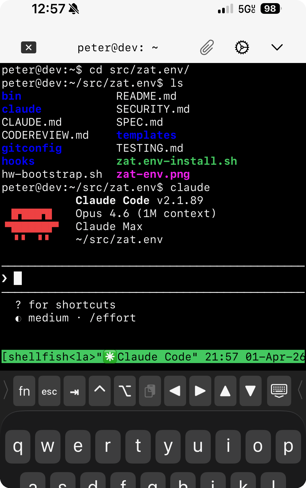

# zat.env

<div align="center">
  
  <br>
  <sub>Claude Code on an iPhone (ShellFish) with tmux, connected via Tailscale SSH to a Linux server in Germany</sub>
</div>

<br>

Minimal harness for verification-first autonomous coding with Claude Code. Verification quality, not prompt engineering, determines the ceiling on what agents can build. This repo implements the thinnest layer that matters: specs as the control plane, adversarial review as the verification loop, persistent artifacts as inter-session memory, and a pre-push gate that blocks unreviewed code from leaving the machine.

Clone this repo and run `zat.env-install.sh` to get spec-driven development, adversarial code review with builder/verifier separation, security auditing, architecture review, test strategy review, and a GitHub PR workflow as Claude Code skills, with a pre-push hook that gates `git push` on passing review. Optional multi-model reviewers (OpenAI, Google, local GPU) provide independent second opinions.

`zat.env-install.sh` is the only requirement: it wires skills, hooks, and conventions into any machine with git, jq, and Claude Code. `hw-bootstrap.sh` is optional and specific to [my always-on dev box](#current-hardware-hetzner-gex44) (a hosted dedicated bare-metal Linux server for GPU workloads with secure remote access). Skills are Markdown prompt files, hooks are bash scripts, conventions are plain text. Nothing is invasive: skills are opt-in (invoke them when you want them), and the pre-push gate has a bypass. Companion writing at [agent-hypervisor.ai](https://agent-hypervisor.ai).

If you're coming from [The Bitter Lesson of Agentic Coding](https://agent-hypervisor.ai/posts/bitter-lesson-of-agentic-coding/), this is the repo. The harness is deliberately minimal because the bitter lesson says it should be.

**Where this is headed.** Today a human is in the loop, reviewing outcomes and writing specs, and the harness serves a single dev pushing to main. The next arc extends the same mechanisms to multiple contributors coordinating through PRs, on the bet that team PRs and agent fleets are the same mechanism: a task queue, isolated branches, a machine-verifiable gate, and a PR as the merge point. See [Roadmap](#roadmap) for the direction statement and candidate increments.

<a id="spec-driven-iteration"></a>

**Spec-driven iteration.** Strong success criteria are the autonomy lever: they let agents loop independently because the agent (and the review skills) can verify "done" without asking. Weak or absent criteria force constant clarification — agents drift, optimize for making tests pass rather than solving the problem, and "works but not good enough" stays vague indefinitely. The spec is what keeps the agent (and the human) oriented: it defines what done looks like, gives review skills something to verify against, and lets a fresh session re-orient from disk without stale context.

A **turn** is one pass through the spec-implement-evaluate loop. One command drives the iteration loop: `/spec`. It's stateful, so the same invocation does different things depending on where the project is:

1. **Define.** `/spec <description>` (or just `/spec`) writes the acceptance criteria.
2. **Implement.** Intervene with manual direction as needed.
3. **Evolve.** `/spec` checks off what's done and reports what's left. Repeat 2-3 until all criteria are met.
4. **Close the turn.** Once the last criterion is checked, evolve mode runs a retrospective ("what did you learn?") and writes a proposal you can pick up next turn.
5. **Next turn.** `/spec` detects the proposal and uses it as the input brief automatically.

**Clear between turns.** Turn boundaries are a natural place to `/clear` the session (or quit and restart Claude Code). The proposal and SPEC.md are on disk, so a fresh session loses nothing and gains a clean context window, which is exactly what the "context pollution in loops" anti-pattern warns against.

**Capture deferred ideas in `BACKLOG.md` (optional).** Turns surface good ideas that don't fit the current or next spec: alternatives considered and rejected for now, adjacent improvements, tangents worth remembering. Rather than bloat SPEC.md's out-of-scope section or lose them to context decay, write them to `BACKLOG.md` at the project root. Use `/spec backlog <description>` to add a pressure-tested entry (gated on specificity, revisit criterion, and why-deferred reason), or edit the file directly. `/spec` reads it when drafting (to avoid re-litigating decided trade-offs) and at turn close proposes deletions that the next `/spec` applies when it consumes the proposal, so the file does not grow monotonically. The mechanism is opt-in: create `BACKLOG.md` only when there is something durable to capture, and reset it anytime with `/spec backlog clear` or `rm BACKLOG.md` when staleness accumulates (git makes both reversible). The skill tolerates absence at every read site, so a project can run indefinitely without BACKLOG.md existing. Format and mechanics are documented in the `/spec` skill.

Start every session with `/spec`. It re-orients from current state: picking up a proposal, reporting progress, or prompting you to define what to build. That costs less than trying to remember where things stand.

Each turn tightens quality. The spec prevents drift across sessions, gives review skills a contract to verify against, and makes "improve quality" a concrete, trackable activity rather than a vague aspiration. When a turn completes, evolve writes a proposal grounded in git history and current state, so the next turn starts with context instead of a blank slate. (See [Philosophy](#philosophy) for the design principles behind this.)

## Contents

- [Quick Start](#quick-start)
  - [Platform support](#platform-support)
  - [What the install script does](#what-the-install-script-does)
- [Daily Workflow](#daily-workflow)
  - [Connecting](#connecting)
  - [Starting a project](#starting-a-project)
  - [zatmux](#zatmux)
- [Agentic Skills](#agentic-skills)
  - [Prompt Design Principles](#prompt-design-principles)
  - [`/spec`: Specification](#spec-specification)
  - [`/codereview`: Adversarial Code Review](#codereview-adversarial-code-review)
  - [`/security`: Security Review](#security-security-review)
  - [`/architect`: Architecture Review](#architect-architecture-review)
  - [`/tester`: Test Strategy Review](#tester-test-strategy-review)
  - [`/pr`: Pull Request Workflow](#pr-pull-request-workflow)
  - [Pre-Push Gate](#pre-push-gate)
  - [Severity Model](#severity-model)
  - [Persistent Review Files](#persistent-review-files)
  - [Cross-Skill Context Graph](#cross-skill-context-graph)
- [Coding Practices](#coding-practices)
- [Philosophy](#philosophy)
- [Theory of Autonomous Improvement](#theory-of-autonomous-improvement)
  - [Design Foundations](#design-foundations)
  - [The Autonomy Spectrum](#the-autonomy-spectrum)
  - [Anti-Patterns We Designed Against](#anti-patterns-we-designed-against)
- [Current Hardware: Hetzner GEX44](#current-hardware-hetzner-gex44)
  - [Machine Specs](#machine-specs)
  - [Setup From Scratch](#setup-from-scratch)
  - [Directory Overview](#directory-overview)
- [References](#references)
- [Roadmap](#roadmap)

---

## Quick Start

```bash
git clone git@github.com:peterzat/zat.env.git ~/src/zat.env
~/src/zat.env/zat.env-install.sh
# Restart Claude Code to pick up skills and hooks
```

This installs on any machine with git, jq, and Claude Code. It symlinks skills into `~/.claude/skills/`, registers hooks in `~/.claude/settings.json`, prunes stale hook entries, sets up git config, and symlinks helper scripts into `~/bin/`. Safe to re-run at any time.

**No hardcoded identity.** Git `user.name` and `user.email` are not stored in this repo. The install script prompts on first run and reuses the existing git config on subsequent runs. Override with `GIT_NAME=x GIT_EMAIL=y@z ./zat.env-install.sh`.

**Generated review files.** `CODEREVIEW.md`, `SECURITY.md`, `TESTING.md`, and `SPEC.md` in downstream project roots are produced by running `/codereview`, `/security`, `/tester`, and `/spec`. The skills that generate them live in `claude/skills/`. These files are working state, not documentation, and should be committed alongside the code they describe.

### Platform support

**Linux (Ubuntu 22.04) is the primary target.** Everything is developed and run
there first, and `hw-bootstrap.sh` provisions that environment end to end.

**macOS is supported** with the setup below. The scripts avoid GNU-only syntax
and fall back to BSD equivalents where the two differ; on Linux those fallbacks
are never reached. The only platform branch is the `jq` install hint in
`zat.env-install.sh`, and it selects wording rather than behavior.

macOS setup, beyond the Quick Start:

1. **Install `jq`** — `brew install jq`. The install script refuses to run
   without it.

2. **Put `~/bin` on your PATH.** The install script creates `~/bin` but does not
   edit your shell rc. The pre-push review gate resolves `codereview-marker` by
   bare name and *fails closed* when it is missing, so `git push` is refused
   until this is set. Add to `~/.zprofile` (login shells, which is what terminal
   windows start — `~/.zshrc` alone is skipped by non-interactive tooling):

   ```bash
   export PATH="$HOME/bin:$PATH"
   ```

   The install script warns when `~/bin` is missing from PATH. This applies to
   Linux too: Ubuntu's `~/.profile` only adds `~/bin` if the directory already
   existed at login, so a first install can need one more login to take effect.

3. **Restart Claude Code after changing PATH.** Hooks run in Claude Code's
   process environment, which is captured at launch. A running instance keeps
   the old PATH, and the gate will refuse pushes until it is restarted.

**macOS version.** `codereview-marker` hashes with `sha256sum` and `md5sum`.
macOS 26 ships both in `/sbin`; earlier versions do not. On older macOS, install
GNU coreutils and put its unprefixed tools on PATH:

```bash
brew install coreutils
export PATH="$(brew --prefix coreutils)/libexec/gnubin:$PATH"
```

That also supplies `timeout`, used by the optional local reviewer. Without it,
`review-external.sh` falls back to Homebrew's `gtimeout`, then to running
unwrapped.

**Not applicable on macOS.** `hw-bootstrap.sh` targets Ubuntu (apt, NVIDIA
drivers, Docker, Tailscale) and should not be run. `claude/references/ml-gpu.md`
and `networking.md` describe the Linux GPU box.

**Optional.** `bin/zatmux` needs `tmux` (`brew install tmux`). `shellcheck`
(`brew install shellcheck`) is only needed to run the full test suite; without
it `tests/run-all.sh` skips the lint check rather than failing.

### What the install script does

The repo stays at `~/src/zat.env/` and remains part of the live system after install. Most configuration is symlinked rather than copied, so the repo and the active config are the same files.

**Symlinked into `~/.claude/` (live, `git pull` updates them immediately):**
- `~/.claude/CLAUDE.md` -> `claude/global-claude.md`
- `~/.claude/skills/spec/` -> `claude/skills/spec/`
- `~/.claude/skills/codereview/` -> `claude/skills/codereview/`
- `~/.claude/skills/codefix/` -> `claude/skills/codefix/`
- `~/.claude/skills/security/` -> `claude/skills/security/`
- `~/.claude/skills/architect/` -> `claude/skills/architect/`
- `~/.claude/skills/tester/` -> `claude/skills/tester/`
- `~/.claude/skills/pr/` -> `claude/skills/pr/`

**Registered as paths into the repo (live, `git pull` updates the content, no re-install needed):**
- `~/.gitconfig` gets `include.path` pointing at `gitconfig/aliases.gitconfig` and `core.excludesfile` pointing at `gitconfig/ignore-global`
- `~/.claude/settings.json` gets hook entries for `hooks/pre-push-codereview.sh` (codereview gate) and `hooks/allow-venv-source.sh` (venv activation auto-approve outside auto mode; in auto mode it makes no decision). Stale hook entries (pointing at scripts removed from the repo) are pruned automatically.
- `~/.claude/settings.json` gets a permissions block (defaultMode, allow list for common dev commands, and a small deny list). The allow list is replaced on each install to prevent session-accumulated cruft; hand-added deny entries are preserved. The deny list is a speed bump, not a security boundary: entries are prefix matches, and the allow list grants general-purpose interpreters (`python3`, `node`, `make`, `git -c`). Install also sets `autoMode.classifyAllShell`, so in auto mode (the default) every shell command, including those, goes through the auto-mode classifier instead of being pre-approved by the allow list; in the other permission modes the allow list still runs them unprompted. Other `autoMode` keys are left alone.

**Re-run `zat.env-install.sh` when:**
- A new skill is added to `claude/skills/` (the symlink for the new skill won't exist yet)
- A new hook is added to `hooks/` (it won't be registered in `settings.json` yet)
- The repo is moved to a different path (all registered paths need updating)

**Updating:**
```bash
cd ~/src/zat.env && git pull
# Re-run install only if new skills or hooks were added:
./zat.env-install.sh
```

---

## Daily Workflow

### Connecting
```bash
ssh peter@dev
# or: ssh peter@dev.emperor-exponential.ts.net
# or from phone via any SSH client (ShellFish, Termius, etc.)
```

### Starting a project
```bash
# Clone a repo and start a tmux session for it
git clone git@github.com:peterzat/myrepo.git ~/src/myrepo
cd ~/src/myrepo
zatmux
```

### zatmux

Tmux session toggle. Optional convenience for tmux users, not required for any of the agentic skills.

Attach from outside tmux, detach from inside:

```bash
cd ~
zatmux                  # attach or create the "shellfish-1" session
zatmux                  # (inside tmux) detach

cd ~/src/ranking
zatmux                  # attach or create a "ranking" session
zatmux                  # (inside tmux) detach
```

Designed around ShellFish (iOS SSH client), which auto-creates a tmux session called `shellfish-1`. Running `zatmux` from `~/` gets you into that session whether it already exists or not. Running it again from inside any tmux session detaches cleanly without killing the session.

If you disconnect (SSH drop, laptop closes), the tmux session keeps running. Come back later with `zatmux` from the same directory, or use `tmux attach -t <name>` and `tmux list-sessions` directly.

---

## Agentic Skills

Global skills are installed by `zat.env-install.sh` and available in all Claude Code sessions. Each skill runs as a forked subagent with its own context window, starts from scratch, and gathers everything it needs from the codebase. Full instructions live in `claude/skills/<name>/SKILL.md`.

| Skill | Command | Invocation | Purpose |
|-------|---------|------------|---------|
| Spec | [`/spec`](claude/skills/spec/SKILL.md) | Manual (the model may also run it) | Define acceptance criteria before implementation |
| Code Review | [`/codereview`](claude/skills/codereview/SKILL.md) | Auto (pre-push) + manual | Adversarial review of uncommitted changes |
| Security | [`/security`](claude/skills/security/SKILL.md) | Manual + chained from codereview | Security audit (full repo or changes-only) |
| Architect | [`/architect`](claude/skills/architect/SKILL.md) | Manual only | Strategic architecture review (10 dimensions, HEALTHY/WATCH/ACT) |
| Tester | [`/tester`](claude/skills/tester/SKILL.md) | Manual only | Test strategy assessment (`/tester`) and durable test-architecture design (`/tester design`) |
| Pull Request | [`/pr`](claude/skills/pr/SKILL.md) | Manual only | Create, inspect, or merge GitHub PRs |

### Prompt Design Principles

All skills share a set of prompt design principles informed by community research on AI code review agents. These principles are embedded directly in each SKILL.md:

- **Report with confidence, filter by severity.** `/codereview` and `/security` report every finding they believe may be real, with a stated confidence, and express uncertainty through severity: an uncertain finding is a NOTE, which never blocks a push or triggers an auto-fix. They do not omit findings for low confidence.
- **Evidence grounding.** Every finding must cite a specific file and line. If the finding depends on code outside the diff, the skill must read that code first. No speculation about unverified behavior.
- **Empty report is valid.** A clean report means the code is clean. Skills never manufacture findings to fill a template.
- **No style policing.** Formatting, naming, and aesthetic preferences are not findings unless they indicate a functional or structural problem.
- **Scoped context reads.** When reading persistent files from prior runs, skills focus on the most recent entry, unresolved BLOCKs, and the metadata footer. Historical entries older than the current branch's base commit are skipped.

These principles address the most common failure mode of AI review agents: generating noise that erodes trust. Noise is controlled by evidence requirements, the style boundary, and severity, not by suppressing findings. Anthropic's guidance for Claude Opus 5 and later is that a review prompt saying "only report high-confidence issues" makes the model report less, and that filtering belongs in a separate pass. A 2026-10-01 test bore this out: re-reviewing 10 diffs that had each passed `/codereview` with a real bug that a later commit fixed, the confidence-reporting prompt caught 9 of the 12 bugs against 7 for an "omit below 80% confidence" prompt, and lost none that the older prompt caught. The cost was more WARN-level findings and about 16% more tokens.

Beyond content-level instructions, skills use Claude Code's `effort` frontmatter field, which overrides the session's effort level while the skill runs. zat.env sets it only where a skill's difficulty is the same in every project: `/security` at `max` (finding vulnerabilities is Anthropic's own example of a max-effort task, and security is where higher effort gains the most), `/codereview` at `xhigh` (the push gate), `/codefix` at `high` (bounded fixes from a findings list), and `/pr` at `medium` (mostly scripted gate checks). `/spec`, `/architect`, and `/tester` set no level and inherit the session's, because their difficulty varies with the task, and whoever picked the session's model and effort is the better judge of it. `CLAUDE_CODE_EFFORT_LEVEL` overrides skill frontmatter for a whole session. The review skills have no separate re-check pass: Claude Opus 5 and later verify their own reasoning without being told to, so each skill states its evidence, severity, and coverage rules in the step where findings are made. `/spec` and `/tester design` keep their design checklists (what input breaks a criterion, what should not be tested), which shape what gets written rather than re-checking it. Convention files like `global-claude.md` describe the same analytical rigor as a behavioral norm, so routine turns outside skills are not over-indexed.

### [`/spec`](claude/skills/spec/SKILL.md): Specification

**Persona:** Principal Product Manager.

**Trigger:** Manual only (`/spec`). Not auto-invoked.

**What it does:**

Defines what done looks like before implementation begins. The output is `SPEC.md`: a verification contract with concrete acceptance criteria that an agent or human can check off. The value of a spec is the acceptance criteria. Everything else (numbered requirements, phased task lists, Given/When/Then ceremony) is optional and only added if the user asks for it.

Six modes:
- **Interview mode** (`/spec new` or first run): asks the user focused questions about goals and acceptance criteria, then writes SPEC.md
- **Direct mode** (`/spec <description>`): reads the codebase, drafts acceptance criteria for the described feature, pressure-tests them, and writes SPEC.md. Also activates automatically when SPEC.md contains a proposal section (see propose mode), using the proposal as the input brief. A proposal with 5 or more commits since its date is still used, with the criteria grounded in the current code, and the output says how old it was.
- **Evolve mode** (`/spec` with existing SPEC.md): assesses progress against current criteria, checks off met criteria, and reports progress. When all criteria are met, runs the turn-boundary transition: asks a retrospective ("what did you learn during this turn?"), then generates a proposal for the next turn grounded in git history and current state.
- **Propose mode** (`/spec propose`): reads the current spec and git history, generates a proposal for the next turn (what happened, key questions, suggested directions), and writes it to SPEC.md for discussion. An existing proposal is regenerated, keeping any retrospective or reply added to it. Useful when evolve was skipped or when pivoting mid-turn.
- **Plan mode** (`/spec plan [<slug>]`): adopts a saved plan from `~/.claude/plans/` as the spec brief, pressure-testing prose outcomes into verifiable criteria. The keyword wins routing even when no SPEC.md exists; with no slug, the most recently modified plan is picked. Detailed handoff is described in the plan-mode paragraph below.
- **Backlog mode** (`/spec backlog <description>` to append, `/spec backlog clear` to reset): captures a deferred idea as a structured `BACKLOG.md` entry with description, why-deferred, revisit criteria, and origin. Pressure-tested at write time (specific *what* and *where*, derivable revisit criterion, concrete why-deferred); fails write rather than admitting a vague entry. The turn-close sweep classifies BACKLOG entries as keep / revisit / recommend-delete with bias toward keep, and the consuming `/spec` applies approved deletions and ACTIVE annotations via `bin/spec-backlog-apply.sh` (also invoked by `/tester design` for rollout entries with `purge-origin:` and `append:` ops). Mechanism is opt-in per project: BACKLOG.md is created on first append and absent-file is a no-op at every read site.

`SPEC.md` uses the same rolling format as other persistent files: current entry, one-line prior summary, structured metadata footer (`<!-- SPEC_META: {...} -->`). Each entry covers one unit of work, not the entire project.

**Framework-informed context.** `/spec` reads the zat.env README in addition to the project's own files. Relevant philosophy, coding practices, anti-patterns, and design principles are extracted and carried into SPEC.md's Context section, so the coding agent has them available during implementation without needing to read zat.env itself. This is selective, not wholesale: only points relevant to the specific unit of work are included.

**Pressure test.** When writing new acceptance criteria (interview, direct, or post-completion evolve mode), a structured pressure-test checkpoint reviews drafted criteria for missing edge cases, unstated assumptions, unspecified failure behavior, and over-specification before writing SPEC.md. This step is skipped for routine evolve-mode check-offs where criteria are unchanged. The skill sets no effort level and runs at the session's.

**What it does NOT do:** generate code, write tests, or run the test suite. It defines the contract. Implementation follows separately.

**Typical workflow:** See [Spec-driven iteration](#spec-driven-iteration) for the full turn-based workflow.

You can also run `/spec propose` at any time to generate a proposal without waiting for all criteria to be met. This is useful for pivoting mid-turn or generating a status snapshot.

For external or cloned projects, SPEC.md describes what you are building or changing right now, not what the project is (that's README territory).

**Complements Claude Code's plan mode.** Plan mode and `/spec` serve different phases of the same work and have a documented handoff. Plan mode is Claude Code's built-in exploratory thinking space: read-only, multi-turn, no persistent artifact, good for "I don't know what I want yet." `/spec` is the commit point: it writes a persistent SPEC.md with testable acceptance criteria, integrates with review skills, and drives the implementation loop. When a plan mode session turns out to be bigger than one-off scratch thinking, exit plan mode and run `/spec plan` to adopt the saved plan as the spec brief (or `/spec plan <slug>` to pick a specific earlier plan). In the reverse direction, if you invoke `/spec` with a brief too vague to produce verifiable criteria, the skill stops and tells you to explore in plan mode first. A PostToolUse hook on `ExitPlanMode` prints a reminder about `/spec plan` every time you leave plan mode so the handoff is visible rather than something to remember.

**Design intent.** Agents without acceptance criteria optimize for "make tests pass" rather than "solve the problem." In autonomous loops, the spec is the artifact that answers "what should I be building?" when the agent starts a fresh session. All review skills read SPEC.md when it exists: `/codereview` checks spec alignment, `/tester` checks whether tests cover the criteria, `/architect` evaluates whether the architecture can support the criteria, `/security` uses the spec for scope awareness.

### [`/codereview`](claude/skills/codereview/SKILL.md): Adversarial Code Review

**Persona:** Principal Software Engineer, adversarial stance.

**Trigger:** Runs automatically before any `git push` (via the pre-push hook gate). Also invocable manually.

**Tiered review.** After gathering the diff, the skill classifies changes as **light** (plain docs only: `.md`, `.txt`, `.gitignore`, `.gitconfig`) or **full** (any code or configuration files). Configuration formats (`.json`, `.yaml`, `.toml`, etc.) get full review because they are often operationally live. So does markdown that instructs an agent (`SKILL.md`, `CLAUDE.md`, `AGENTS.md`, files under `.claude/`), because it grants tools and steers what the agent runs. Light review skips the test suite, security chain, external reviewers, and fix loop. This keeps docs-only pushes fast while maintaining the full pipeline for code and config changes.

**Refresh review optimization.** When a prior CODEREVIEW.md exists with `block: 0` and the reviewed commit is an ancestor of HEAD, the skill performs an incremental review scoped to files changed since the prior review. This keeps iterative fix-and-review cycles fast without re-evaluating the entire diff.

**Full review pipeline:**
1. Reads prior review state from CODEREVIEW.md, SECURITY.md, TESTING.md, and SPEC.md (scoped reads)
2. Gathers the diff against the push gate's base (committed-but-unpushed and uncommitted changes; the whole tree on a first push), classifies the review tier, and checks for a prior successful review (refresh detection); if eligible, scopes to files changed since then
3. Launches `/security` in the background, scoped to files changed since the last security scan (or since upstream if no prior scan), counting committed, staged, and unstaged changes. Agent-instruction markdown (`SKILL.md`, `CLAUDE.md`, `AGENTS.md`, files under `.claude/`) is in scope; other markdown is not. If nothing in scope changed since the prior scan, carries forward existing findings instead of re-invoking.
4. Runs the project's test suite (if one exists) to capture a baseline, then launches Claude Code's built-in `/code-review high` in the background as a second, independent finder
5. Reviews for correctness, code quality, solution approach, spaghetti detection (mixed concerns in one commit), regression risk, and spec alignment (if SPEC.md exists)
6. Collects `/security`'s findings, runs optional external reviewers (OpenAI, Google, local GPU) via `review-external.sh` if configured (findings tagged with provider name), and collects the built-in review's findings, tagged `(claude-code)`
7. Classifies every finding as BLOCK / WARN / NOTE with evidence citations
8. Delegates BLOCK/WARN fixes to `/codefix`, a separate skill that runs in its own forked context (builder/verifier separation, up to 3 fix/re-review cycles). After each pass it re-reviews the changes and runs `/security` on exactly the files codefix changed, so no fix reaches the push without a security pass and SECURITY.md stops listing fixed findings as open
9. Re-runs tests after each fix cycle; stops if tests regress
10. Writes a content-addressed marker file so the pre-push hook allows the next `git push`
11. Updates `CODEREVIEW.md` with a dated entry and structured metadata footer

**No separate re-check pass.** Claude Opus 5 and later verify their own reasoning without being told to, and Anthropic measured that removing explicit re-check steps saves tokens with no loss in quality. The standards a re-check used to enforce live where the finding is made: evidence grounding in the principles, traced callers in the regression-risk dimension, and the preparatory-refactoring exception in the spaghetti dimension. Independent verification comes from separate contexts (the review itself, `/codefix`, external reviewers, tests), not from the reviewer re-reading its own work. The skill runs at `effort: xhigh` via frontmatter.

**Builder/verifier separation.** The reviewer never fixes code itself. When BLOCK or WARN findings exist, it writes CODEREVIEW.md and delegates to `/codefix`, a separate skill that runs in its own forked context with no memory of the review's reasoning. Codefix reads findings as a spec and applies minimal fixes. The reviewer then re-evaluates independently. No agent grades its own work.

**External reviewers (optional).** When API keys are configured in `~/.config/claude-reviewers/.env`, the codereview skill pipes the diff through `review-external.sh` to get independent findings from OpenAI and/or Google models. A local GPU reviewer (Qwen2.5-Coder-14B via [qwen-2.5-localreview](https://github.com/peterzat/qwen-2.5-localreview)) is also supported: useful as a fast second opinion at zero API cost, though the 14B model produces more false positives than cloud models and should not be treated as authoritative. Findings are tagged with the provider name. All external reviewers fail open: missing config, empty input, API errors, or absent local setup produce no findings. Runs once at initial review, not during fix/re-review cycles.

**External-only mode (`/codereview external`).** A separate dispatch on `/codereview` runs only the configured external reviewers on an arbitrary diff. The default scope is `<upstream>..HEAD` (matching the full review's diff window), but a single ref like `/codereview external v1.3` reviews `v1.3..HEAD`, an explicit `<from>..<to>` or `<from>...<to>` is used verbatim, and natural-language phrasings like "since v1.3" or "last 5 commits" are normalized before validation. The mode does NOT mutate CODEREVIEW.md, write the push marker, or invoke `/codefix`; output is terminal-only with a footer making the no-mutation contract explicit. Unlike the full review's silent fail-open, external-only fails loudly with a pointer to the env file when no providers are configured (via `review-external.sh --check`). Headline use case: span-of-release second opinions like `/codereview external v1.3` to ask the cloud models "what stands out across this whole release?" without disturbing any working files. Pre-PR sanity checks and cross-model audits are also natural fits.

**Review pipeline sequencing.** `/codereview`'s own review runs inline. `/security` is the longest step (a median of about 16 minutes across 49 runs in three projects, at `effort: max`) and needs only the review scope, so it starts as a background fork as soon as the scope is known and overlaps the test run, the inline review, and the other finders; if its report arrives before the inline review is done, the reviewer finishes its own review first. Claude Code's built-in `/code-review high` runs as a separate `claude -p` process, launched in the background after the test run and collected after `/security`, so it overlaps the inline review and the security scan and rarely adds wall-clock time; it bills to the user's Anthropic plan. Its output goes to a file that is read only after it finishes, so its findings cannot anchor the inline review. Configured external reviewers (cloud and local) run in parallel with each other, then all findings are merged and classified in one place. The built-in review is a second finder rather than a replacement because the inline review owns what the built-in lacks: the push gate's diff scope (including a first push), review-file exclusions, severity, and the fix loop. It earned the slot on evidence: on 10 diffs that had each passed `/codereview` with a real bug a later commit fixed, `/code-review high` caught 10 of the 12 bugs, including every one `/codereview`'s own review caught (9), at about 40% of the cost. Like the external reviewers, the built-in review fails open and runs once per review.

**Key guard:** Never deletes, skips, or weakens existing tests to make them pass. Fixes the code, not the tests.

### [`/security`](claude/skills/security/SKILL.md): Security Review

**Persona:** Principal Security Engineer.

**Trigger:** Manual invocation, or chained automatically from `/codereview`.

**Scope:** Controlled via arguments. `/security` reviews the full repo. `/security changes-only` focuses on the current diff. `/security path/to/file` reviews a specific file. `/codereview` also uses `/security post-fix <files>` after a `/codefix` pass, which re-checks the changed files and updates the entry the same review wrote earlier.

**What it does:**
1. Reads prior security state from SECURITY.md, CODEREVIEW.md, and SPEC.md (scoped reads)
2. Scopes the review based on arguments
3. Reviews across 8 dimensions: secret leaks (including git history), input/output sanitization (with data flow tracing), auth/authz, dependency supply chain, infrastructure security, AI-specific risks (prompt injection, unvalidated LLM output), data exposure, and PII in source
4. Reports findings with concrete attack vectors. "An attacker could theoretically..." without specifying how they reach the code path is not a finding.
5. Updates `SECURITY.md` with dated findings, resolved/open status, and accepted risks

**Standards and coverage, no re-check pass.** Each finding's attack vector must trace a concrete path from attacker-controlled input through code the skill read, and the severity definitions carry the calibration rules (no reachable vector, no BLOCK; defense-in-depth gaps are WARN). Each SECURITY.md entry records its coverage: dimensions or files not fully reviewed and why, and which files' git history was checked for secrets, so the next session knows what the clean report actually covers. A scan scoped to some files carries open findings in the other files forward at their original severity, marked not re-checked, so a narrow scan never drops them from SECURITY.md or its counts. The skill runs at `effort: max` via frontmatter.

### [`/architect`](claude/skills/architect/SKILL.md): Architecture Review

**Persona:** Senior Architecture Review Board.

**Trigger:** Manual only (`/architect`). Not auto-invoked. Supports focused deep-dives: `/architect deps`, `/architect ops`, `/architect <topic>`.

**What it does:**
1. Reads all four persistent files (CODEREVIEW.md, SECURITY.md, TESTING.md, SPEC.md)
2. Explores the codebase: README, directory structure, languages, frameworks, entry points, dependency manifests, CI/CD configs, onboarding docs
3. Evaluates 10 dimensions in two groups:
   - **Design Quality:** structural clarity, appropriate complexity, scale alignment, dependency health (includes outdated packages, license risks, bloat, upgrade paths, vendor lock-in), extensibility
   - **Strategic Fitness:** consistency, business goal alignment, technology selection, operational fitness, developer experience
4. Reports per dimension with HIGH / MEDIUM / LOW priority, or "Nothing to flag"
5. Produces a Strategic Summary with a board recommendation: HEALTHY / WATCH / ACT
6. Produces no persistent file (terminal node; see [Cross-Skill Context Graph](#cross-skill-context-graph))

**What counts as a finding.** Six rules, applied while evaluating rather than as a second pass, calibrate findings to the project's actual scale and goals: complexity concerns name concrete costs, extensibility recommendations need evidence of anticipated changes, transitional inconsistency is not drift, technology changes need evidence of friction, and operational expectations match the deployment model. The skill sets no effort level and runs at the session's.

**"No strategic concerns at this time"** is a valid and expected outcome. Most codebases have sound architecture.

### [`/tester`](claude/skills/tester/SKILL.md): Test Strategy Review and Design

**Persona:** Principal Software Design Engineer in Test (SDE/T).

**Trigger:** Manual only (`/tester` for audit, `/tester design` for architecture design). Not auto-invoked.

**Two modes:**

- **Audit mode** (`/tester`): reviews the live test strategy and appends a dated finding to TESTING.md. Reads prior assessment (scoped: most recent entry + metadata footer), discovers test infrastructure, evaluates 9 dimensions (test coverage strategy, automation maturity, automatic execution, CI/CD integration, framework choices, fixture management, flaky test patterns, missing categories, and development loop cadence), reports findings as BLOCK / WARN / NOTE.

- **Design mode** (`/tester design`): writes or revises a durable test-architecture contract. The contract is a section under the exact H1 heading `# Durable test-architecture contract` appended to TESTING.md; a fresh Claude session can cold-open it and know how to run the suite and add a new test without reading other files. The section covers a cold-open command, the single entry point, a duration philosophy, a proxy/drift strategy, a human-eval strategy, and a "what not to test" precision boundary. Alongside the contract, design mode appends rollout entries to `BACKLOG.md` (each with `Origin: tester design YYYY-MM-DD`) for the concrete work needed to move the project toward the contract. Those rollout entries flow through `/spec`'s normal cycle: the overlap scan at draft, the Backlog Sweep at turn close, and revisit-candidate adoption when criteria fire.

**Design-mode flows:**

- *Greenfield bootstrap:* `/tester design` on a project with no contract yet seeds a minimum contract plus rollout entries. Proportional to the project's current maturity — a new prototype does not get a three-tier dispatcher.
- *Revision:* `/tester design` again replaces the contract section and dedups prior `tester design`-origin rollout entries in BACKLOG.md, except entries annotated `(ACTIVE in spec YYYY-MM-DD)` which are preserved as committed spec work. `git diff` shows what changed.
- *Reject:* `git checkout TESTING.md BACKLOG.md` reverts the design when the files existed before the run; `rm -f TESTING.md BACKLOG.md` clears them when this run created them. No marker files, no hidden state.
- *Audit after design:* `/tester` appends its dated finding ABOVE the contract H1; the contract section below is preserved intact.
- *Pre-apply checklist (visible to user):* before any TESTING.md or BACKLOG.md mutation, design mode posts a fixed five-component block — signals fingerprint, contract shape + line count, rollout count + justification, per-entry overlap scan, and a conditional SPEC tension line when SPEC.md punts the testing surface this rollout fills. The contract is drafted in memory in Step D.4 and only written in Step D.6 step 1, so the checklist is a true pre-mutation gate: nothing has changed on disk yet when it appears. Always-on, never gated. The SPEC tension line is flag-not-block (post and proceed; the user can interrupt). This is the user's course-correct surface for the proportionality and overlap calls the LLM made silently in earlier steps.

**More proxy, less critic.** The design-mode prompt pushes projects toward measurable proxies (latency windows, perceptual-hash tolerance, JSON-schema adherence, baseline diffs) rather than adding another critic (an LLM reading output). This is the oracle/proxy/critic split from [The Bitter Lesson of Agentic Coding](https://agent-hypervisor.ai/posts/bitter-lesson-of-agentic-coding/): critics are cheap and weak (shared blind spots with the generator); proxies catch regressions the generator cannot see.

**"This is fine for now"** remains valid for audit mode. A new prototype with a few pytest files and no CI is fine. A production API with no integration tests is not. Audit is always proportional to the project's maturity and goals.

### [`/pr`](claude/skills/pr/SKILL.md): Pull Request Workflow

**Trigger:** Manual only (`/pr`). Not auto-invoked.

**What it does:**

Five modes dispatched by argument:

- `/pr` or `/pr <branch-name>` -- create a PR. If on `main`, creates a feature branch:
  when a branch name is given, uses it with an appropriate prefix (`feat/`, `fix/`, `docs/`);
  when no branch name is given, derives one from the commit message (lowercased, hyphenated,
  with the same prefix convention). Checks for an existing PR on the branch (idempotent;
  will not create duplicates). Composes the title from commit messages (single commit: uses
  the commit message; multiple commits: writes a concise summary under 70 chars) and the
  body from review file metadata.
- `/pr status` -- show the current branch's PR state, CI checks, and merge readiness
- `/pr <number>` -- inspect a specific PR and summarize review comments
- `/pr merge` -- verify REVIEW_META in CODEREVIEW.md (block: 0, reviewed commit is ancestor
  of HEAD), check GitHub merge readiness, then `gh pr merge --squash --delete-branch`
- `/pr list` -- list open PRs for the repo

**Auto-composed PR descriptions.** The skill reads metadata footers from CODEREVIEW.md,
SECURITY.md, TESTING.md, and SPEC.md to populate a review status table and spec summary
in the PR body. Review files written by other skills become the PR description with no
extra work.

**Review gate on merge.** `/pr merge` verifies that CODEREVIEW.md shows a passing review
(`block: 0`) covering the current code, then checks GitHub merge readiness: CI checks
must pass, the PR must be mergeable (no conflicts), and no pending or change-requested
reviews. A PR cannot be merged through this skill without passing both the review gate
and remote checks.

**Design intent.** Right now, `/pr` is primarily a convenience for composing PR descriptions
and running `gh pr create`. Direct-to-main remains the default solo workflow, and PRs are
opt-in. The longer-term purpose is to establish PRs as the coordination primitive for
autonomous agent loops (see [Design Foundations](#design-foundations)). Terminal node
in the context graph: reads review metadata, produces no persistent file.

### Pre-Push Gate

A Claude Code `PreToolUse` hook (configured in `~/.claude/settings.json`) intercepts every `git push` command. The push is blocked unless `/codereview` has been run and passed on the current diff.

**Gate condition:** all BLOCK items resolved and tests have not regressed. Unresolved WARNs are reported but do not block the push.

**Flow:**
1. Claude attempts `git push`
2. Hook reads the JSON payload from stdin and checks if the command is `git push`
3. Hook checks for a marker file at `${XDG_CACHE_HOME:-${HOME}/.cache}/claude-codereview/marker-<project-hash>` (per-user, mode 0700)
4. Marker contains a diff hash from the passing review: `sha256sum` of `git diff <upstream>` (excluding review output files), truncated to 16 hex chars. This makes the marker content-addressed: tied to the exact diff that was reviewed, not just "some review happened."
5. If marker exists and hash matches current diff, push proceeds
6. Otherwise, push is blocked; Claude is instructed to run `/codereview`

The marker is per-project (scoped by git root path hash) and content-addressed. It persists after a successful push so that a network error or remote rejection does not force a full re-review. Making any code change after a passing review invalidates the hash and requires a new review.

**"Push now" bypass.** Say "push now" to skip codereview for a single push. Claude creates a one-time bypass marker and pushes immediately. This is a human escape valve for when the full review pipeline is not needed.

### Severity Model

All skills use a consistent three-level severity model:

| Level | Meaning | Gates push? | Action |
|-------|---------|-------------|--------|
| **BLOCK** | Must fix before pushing | Yes | Auto-fixed by /codefix; others report to human |
| **WARN** | Should fix; significant gap | No | Auto-fixed by /codefix; others report to human |
| **NOTE** | Informational; improvement opportunity | No | Reported only, never auto-fixed |

The pre-push gate passes when all BLOCKs are resolved and tests have not regressed. Unresolved WARNs are reported but do not block the push. Findings carried forward from a prior review retain their original severity unless the human explicitly adds them to the Accepted Risks section of CODEREVIEW.md.

### Persistent Review Files

Four skills write per-project files to the project root. These files are working state, not documentation. They serve as inter-session memory: each skill invocation reads relevant files to avoid re-reporting resolved issues and to track whether recommendations were adopted. Each file ends with a structured metadata comment (e.g., `<!-- REVIEW_META: {...} -->`) that enables future tooling for convergence detection and trending.

| File | Written by | Contents |
|------|-----------|----------|
| `SPEC.md` | `/spec` | Current acceptance criteria, goal, context |
| `BACKLOG.md` | `/spec` (optional), `/tester design` | Deferred proposals register: ideas considered and deferred, with revisit criteria |
| `CODEREVIEW.md` | `/codereview` | Dated review history, findings, fixes applied |
| `SECURITY.md` | `/security` | Security findings, resolved issues, accepted risks |
| `TESTING.md` | `/tester`, `/tester design` | Dated audit entries above a durable test-architecture contract section |

### Cross-Skill Context Graph

Skills read each other's persistent files to share context. The reading graph has cycles (e.g., /spec reads CODEREVIEW.md while /codereview reads SPEC.md), but amplification is bounded by three mechanisms: (1) scoped reads (most recent entry, unresolved BLOCKs, and metadata footer only, not full history), (2) terminal nodes (architect and pr produce no persistent files, breaking feedback loops), and (3) independent severity assessment (each skill evaluates from its own analysis, not by inheriting other skills' findings).

```
                    SPEC.md (upstream of all review skills)
                       |
                       v
spec        -> writes SPEC.md and BACKLOG.md (reads CODEREVIEW.md, TESTING.md for context)
codereview  -> reads SPEC.md, SECURITY.md, TESTING.md
security    -> reads SPEC.md, CODEREVIEW.md
tester      -> audit: reads SPEC.md, SECURITY.md, CODEREVIEW.md; writes TESTING.md
            -> design: reads TESTING.md, SPEC.md, BACKLOG.md; writes TESTING.md contract + BACKLOG.md rollout
architect   -> reads all four (terminal node, produces no persistent file)
pr          -> reads all four metadata footers (terminal node, produces no persistent file)
```

SPEC.md sits upstream of all review skills as the intent declaration. Review skills read it to check alignment, coverage, and scope, but never modify it. Architect and pr are terminal nodes: their output informs human decisions and does not feed back into automated review. This prevents recommendations from becoming automatic codereview criteria without deliberate human adoption.

---

## Coding Practices

These instructions are embedded in [`claude/global-claude.md`](claude/global-claude.md) and active in every Claude Code session on this machine. They are the operational translation of the philosophy above into day-to-day coding behavior.

- Work in small, committable increments. Get one thing working before adding the next. Do not build scaffolding for features that are not needed yet.
- Before implementing changes, verify the project builds and existing tests pass. Fix pre-existing failures before adding new work.
- When adding or changing functionality, write or update tests in the same increment. If the project has no test infrastructure, add a minimal test runner first.
- Run the test suite (or the relevant subset) after each functional change. Do not stack multiple untested changes.
- When fixing a bug, change only what is necessary. Do not refactor surrounding code or improve unrelated code in the same change.
- If a change causes previously passing tests to fail, revert it and try a different approach. Do not modify tests to accommodate a regression.
- If two consecutive fix attempts fail, stop, revert to the last working state, and re-evaluate the approach.
- Before switching tasks or when context grows large, write key decisions and current state to a file (commit message, README, or project-specific doc). Prefer restarting with a written plan over continuing with a long, stale context.
- Do not push, open PRs, or modify remote state unless explicitly asked. Committing is local and reversible; pushing is a shared-state action for the user to decide.


These practices are deliberately minimal. Shorter, more specific instructions outperform comprehensive ones for AI agents: as instruction volume grows, compliance with any single instruction drops (instruction dilution). Each bullet targets a specific failure mode that agents cannot reliably self-correct without explicit guidance. If a practice can be enforced by tooling (linting, hooks, tests), it belongs in tooling, not here.

---

## Philosophy

**Claude Code as the primary development tool.** This environment is built for long autonomous coding sessions where Claude reviews its own work, fixes issues, and iterates. Skills, hooks, and conventions provide the structure: adversarial review before pushing, quantitative signals to detect convergence, and circuit breakers to cap runaway loops.

**Always-on, never a snowflake.** Long agentic loops need an always-reachable machine: sessions that survive SSH disconnects, overnight jobs that keep running, an environment tuned for the work. But a hand-configured machine is a liability. Everything must be reproducible: `hw-bootstrap.sh` provisions bare metal, `zat.env-install.sh` installs the agentic layer, and the combination recovers the full environment from scratch. Any hardware that meets the minimum spec and is reachable via Tailscale works.

**Verification over prompting.** The quality of automated verification determines the ceiling of what agents can build. A well-designed test suite and review loop is worth more than a better prompt.

**Two kinds of enforcement.** Some safety properties are enforced by code (the pre-push hook blocks pushes without a matching diff hash, allowed-tools prevents codereview from using Edit). Others are enforced by prompt instructions (the 3-cycle fix limit, "never fix code yourself," the finding format contract between codereview and codefix). Prompt-enforced properties are non-deterministic: the LLM usually follows them, but compliance is not guaranteed. This is a deliberate trade-off. Hard-coding every constraint would make the system rigid and the skills unable to adapt. Instead, zat.env uses hard gates for irreversible actions (pushing code) and prompt instructions for everything else, with structural tests (`tests/lint-skills.sh`) that verify the contracts between prompted and hard-coded components have not drifted apart. When a new constraint is added, the question is: what is the cost of the LLM not following this instruction? If the answer is "code reaches the remote repository unchecked," it needs a hard gate. If the answer is "a review finding gets mis-categorized," a prompt instruction with a structural lint check is sufficient.

**Prompts must earn their keep.** Every instruction in a skill or convention competes for the model's attention with every other instruction (the curse of instructions: compliance with any single rule drops as the count grows). When adding or maintaining a prompt, ask two questions: what model behavior is this supposed to change, and how would I know if it's working? Instructions that cannot answer both are the first to delete. This posture is why coding practices are deliberately minimal, why skills load on demand rather than sitting in the always-on context, and why most safety properties live in hooks rather than prose — enforcement is verifiable, prompt instructions are not. It also sets the bar for new additions: a proposed instruction must name the failure mode it prevents and be falsifiable enough that a future review can tell whether it is still earning its slot.

**Re-baseline on each model generation.** Every piece of a harness encodes an assumption about what the model cannot do on its own, and a new model generation invalidates some of those assumptions. When one ships, zat.env is re-checked against Anthropic's guidance for that model and, where a claim can be tested, against real data. v1.5 was the Claude Opus 5.5 pass: effort pinned only where a skill's difficulty is fixed, self-verification passes removed because the model now checks its own reasoning, and the review prompts' confidence threshold replaced after a measured test on bugs that earlier reviews had missed. It closed with Claude Code's `/doctor prompt-audit` over every skill, and a person reviewed each finding before any edit landed: the audit can tell that a line was written for an older model, but whether a guard still earns its place depends on failures and workflows only the maintainer has seen. Verification, specs, and persistent review files were left alone. They do not compensate for a model limit, so they do not decay with it.

**Spec is code.** For agentic coding, a spec is not documentation. It is the verification contract that defines what done looks like. Without acceptance criteria, agents optimize for passing tests rather than solving the problem. A well-written acceptance criterion is worth more than a well-written prompt, because it tells the agent (and the review loop) what to verify. SPEC.md sits upstream of all review skills: codereview checks spec alignment, tester checks criteria coverage, architect evaluates whether the architecture serves the spec's goals. In autonomous loops, the spec is what lets a fresh agent session re-orient from disk and pick up where the last session left off. When a turn completes, the spec skill writes a proposal grounded in git history and current state, so the next turn inherits concrete context rather than starting cold.

**Severity over silence.** False positives erode trust in automated review, and so do bugs that reach production after a clean review. Review skills report what they find with a stated confidence and let severity do the filtering: an uncertain finding is a NOTE, which never blocks a push or triggers an auto-fix. "No issues found" remains the correct outcome for quality code, and skills never manufacture findings to fill a report.

**Elements of autonomy.** Four things work together to enable long-running coding loops without human intervention per-cycle: reasoning effort matched to the step (fixed high levels on the review gate and security scan, where verification depth matters most; the session's own level for spec and design work), spec-driven development (concrete acceptance criteria that tell the agent what to build and when it is done, with turn-boundary proposals that carry context forward), role-based agents (skills with distinct personas that review, verify, and gate each other's work), and artifact-based memory (SPEC.md, CODEREVIEW.md, SECURITY.md, TESTING.md are checked into git and survive across sessions, so a fresh agent can re-orient from disk). Remove any one element and the loop degrades: without specs, agents drift; without review agents, quality drops; without artifacts, sessions lose continuity; without effort control, critical analysis is shallow.

**Autonomy spectrum.** Start supervised (Claude proposes, human reviews). Grow toward autonomous operation with guardrails: adversarial review skills, pre-push hook gates, structured constraints.

**Portable by design.** This setup is coupled to Claude Code and Ubuntu Linux, both first-rate for agentic workloads. Beyond those two choices, everything is portable: skills are Markdown, hooks are bash, conventions are plain text. If Claude Code gains a serious competitor or a different model pulls ahead, the work to port is swapping skill invocation syntax and hook registration, not rethinking the architecture.

**Grow incrementally.** Start simple. Add complexity only when earned by real use cases.

**Improvements flow upstream.** zat.env is a shared, evolving system. Skills, hooks, and conventions are symlinked into every project, so improvements compound across all current and future work. When a downstream project reveals a skill gap, prompt issue, or missing convention, the fix is made in the zat.env repo, never patched locally in a downstream project. The feedback loop: stop, note the issue, switch to zat.env to make the fix, return to the downstream project. Local patches (per-project memory overrides, inline edits to symlinked files) help one project while the same issue persists everywhere else.

---

## Theory of Autonomous Improvement

### Design Foundations

The design is grounded in two Anthropic Engineering papers: Carlini's [parallel Claude compiler](https://www.anthropic.com/engineering/building-c-compiler) (16 agents, 100K lines of Rust, verification quality as the ceiling on output quality) and Rajasekaran's [harness design for long-running development](https://www.anthropic.com/engineering/harness-design-long-running-apps) (separate generation from evaluation, even when the same model does both). Applied here: invest in verification before investing in prompts. A well-designed review loop is worth more than a better system prompt.

See [The Bitter Lesson of Agentic Coding](https://agent-hypervisor.ai/posts/bitter-lesson-of-agentic-coding/) for the full argument: why agents cannot one-shot complex projects, how spec-driven turns solve the drift problem, and why minimal harness design follows from the bitter lesson.

### The Autonomy Spectrum

```
Supervised          Claude proposes, Peter reviews and approves everything
    |
Gated               Pre-push hook ensures review passes before code leaves the machine
    |
Autonomous          Review skills run in loops; Claude fixes and iterates without interruption
    |
Multi-agent         Parallel Claude sessions across projects with shared verification state
```

The current system is at **Gated**. The build order does not follow the ladder: the roadmap approaches **Multi-agent** coordination mechanics (PRs, CI-side gates, shared task queues) before fully **Autonomous** loops, because those mechanics serve human multi-dev work immediately and are the same mechanics a fleet needs. Autonomous review/fix/review cycles then arrive as the inner loop of each fleet worker, with the human reviewing outcomes rather than individual steps.

### Anti-Patterns We Designed Against

**False positive factories.** Skills that manufacture findings to fill structured templates. Countered by: explicit precision-over-recall instructions, "no findings is valid" in every skill, evidence grounding requirement.

**Context exhaustion.** Agents that read too much and degrade quality as context fills. Countered by: scoped persistent file reads (most recent entry + BLOCKs + metadata footer only), prioritization of high-risk files for large diffs.

**Circular amplification.** A NOTE becomes a BLOCK through cross-skill contamination (codereview flags something, security escalates it, architect recommends refactor, codereview flags code for not following the recommendation). Countered by: scoped reads (most recent entry only), terminal nodes (architect produces no persistent file), independent severity assessment.

**Auto-fix oscillation.** Fix A breaks B, fix B reintroduces A. Countered by: builder/verifier separation (codefix runs in a separate forked context from the reviewer), one-issue-per-fix cap, 20-line-per-fix cap, 3-cycle limit, independent re-review after each fix cycle.

**Stale context poisoning.** Persistent files describing code that no longer exists. Countered by: commit-hash-scoped metadata, skip entries older than base commit, keep only current entry + prior summary. Condensing relies on git history as the archive, so when CODEREVIEW.md, SECURITY.md, or TESTING.md has uncommitted changes, the skill carries the prior entry forward verbatim under a "not current findings" heading instead of condensing it; the next run after a commit condenses normally.

**Spec-less loops.** Agent loops without acceptance criteria optimize for test-passing rather than problem-solving. The agent may write code that satisfies the test suite but misses the actual goal, or drift away from the original intent over multiple iterations. Countered by: SPEC.md with concrete acceptance criteria that define what done looks like; codereview checks spec alignment; fresh agent sessions re-orient from the spec rather than relying on stale context.

**Context loss at turn boundaries.** A turn completes, the agent says "done," and the next session starts with no memory of what was learned. Rejected approaches get re-tried, surprises get re-discovered, shifted priorities get forgotten. Countered by: evolve mode's retrospective prompt captures learnings while the conversation is still live, and the proposal carries forward a grounded summary of what happened and what to tackle next. The proposal lives in SPEC.md on disk, so a fresh session inherits it without depending on conversation memory.

**Placeholder implementations.** Agent writes code that compiles and passes type checks but does not implement the actual logic (empty function bodies, hardcoded return values, `TODO` stubs). Common in self-healing loops where the agent optimizes for "make the tests pass" rather than "solve the problem." Countered by: test suites that verify behavior (not just compilation), baseline snapshot diffing to catch suspiciously small deltas, and human checkpoint intervals in loop orchestration.

**Context pollution in loops.** Each loop iteration accumulates file reads and tool results. By iteration 4-5, the context window is saturated with stale information from earlier attempts, degrading output quality. Countered by: fresh agent sessions per iteration (progress lives in files and git, not context), scoped reads of persistent review files (most recent entry only), and convergence-based early termination.

**Regression snowballing.** In a loop without baseline snapshots, pre-existing failures get attributed to the agent's changes, triggering fix attempts for code the agent didn't break. The fixes introduce real regressions, compounding the problem. Countered by: baseline state capture before any changes, regression defined as "worse than baseline" (not "any failures"), and hard stops when test count decreases between iterations.

**Local patching of shared conventions.** Fixing a skill deficiency or convention gap in a per-project memory file or local CLAUDE.md rather than in zat.env. The fix helps one project while the same issue persists in every other project. Countered by: the shared system boundary rule in global-claude.md (do not modify symlinked files from downstream), and the principle that skill behavioral corrections belong in skill definitions, not memory files.

---

## Current Hardware: Hetzner GEX44

The agentic workflow runs on any Linux machine with sufficient resources and a Tailscale connection. The Hetzner GEX44 was selected because it keeps a dedicated GPU box running 24/7 at practical cost. If needs change, the hardware can be swapped without changing any of the agentic tooling.

The only hard networking requirement is Tailscale. All access goes through the Tailscale mesh: SSH, Claude Code remote sessions, everything. The bootstrap script configures Tailscale as one of its first steps.

There's no real difference between a hosted dev box like this and a physical machine in your closet, as long as it's always on and securely reachable over SSH.

### Machine Specs

| Spec       | Value                                                         |
|------------|---------------------------------------------------------------|
| CPU        | Intel Core i5-13500 (14 cores: 6P+8E, 20 threads)            |
| GPU        | NVIDIA RTX 4000 SFF Ada (20GB ECC GDDR6, 6144 CUDA cores, 192 Tensor cores, 70W TDP) |
| RAM        | 64 GB DDR4                                                    |
| Storage    | 2 x 1.92 TB NVMe SSD, RAID-1 (~1.92 TB usable)              |
| Network    | 1 Gbit/s, unlimited traffic                                   |
| OS         | Ubuntu 22.04.2 LTS                                            |
| Python     | 3.10 (system); projects always use per-project venvs          |
| Provider   | Hetzner dedicated (GEX44), Falkenstein DC                     |

**GPU notes:**
- 20GB VRAM fits ~7-8B parameter models natively; ~32B quantized (IQ4_XS = 16-17 GB)
- 70W TDP is the low-power SFF variant. Good for inference and experimentation, limited for heavy training.
- Use `--gpus all` for Docker GPU access; always `--shm-size=8g` or `--ipc=host` for PyTorch DataLoader

**Hetzner notes:**
- Networking uses a /32 point-to-point config with `on-link: true` gateway routing. Do not modify netplan without understanding this.
- Cryptocurrency mining is strictly prohibited (Hetzner will terminate the account)

**Networking and access:**
- **Public DNS**: `dev.agent-hypervisor.ai` (A record to Hetzner public IP)
- **Tailscale**: hostname `dev`, tailnet `emperor-exponential.ts.net`, FQDN `dev.emperor-exponential.ts.net`
- **Access pattern**: Mac/iPad connects via Tailscale to `dev:PORT` for web UIs (Jupyter, Gradio, FastAPI, etc.)
- **Bind address**: always `0.0.0.0` (not `127.0.0.1`) so Tailscale clients can reach services
- **Public exposure**: `dev.agent-hypervisor.ai:PORT` for webhook callbacks or temporary demos only
- **No reverse proxy**: services bind directly to ports
- **Firewall (UFW)**: active; deny incoming, allow SSH (22/tcp) and all on tailscale0

These are per-machine values. See `claude/references/networking.md` for the full conventions.

### Setup From Scratch

Two scripts take a bare Hetzner Ubuntu 22.04 install to a fully provisioned agentic dev box: `hw-bootstrap.sh` handles system packages, the GitHub CLI, Node.js (LTS), NVIDIA drivers, CUDA, Docker, Tailscale, and Claude Code. `zat.env-install.sh` wires skills, hooks, and conventions into the live system. The process requires two bootstrap runs (one before and one after the NVIDIA driver install and reboot) plus a manual driver selection step.

See [docs/hardware-setup.md](docs/hardware-setup.md) for the full step-by-step walkthrough.

### Directory Overview

Post-install layout (annotated):

```
~/
├── bin/                              # Helper scripts (symlinked into ~/bin by install)
│   ├── codereview-marker             # Resolve base and security surface, compute/write/locate the codereview push marker (single source of truth)
│   ├── codereview-skip               # Create one-time bypass marker for pre-push gate
│   ├── review-external.sh            # External multi-model reviewer (stdin diff, stdout findings)
│   ├── spec-backlog-apply.sh         # Apply BACKLOG sweep manifest from stdin (used by /spec Step 3g)
│   └── zatmux                        # Attach/create tmux session based on current dir
│
├── data/                             # Shared large datasets and model files (not in git)
│
├── src/
│   └── zat.env/                      # This repo: cross-project config and tooling
│       ├── README.md                 # This file
│       ├── CLAUDE.md                 # How to work on the zat.env repo itself
│       ├── .gitignore
│       ├── hw-bootstrap.sh           # Bare machine -> usable dev box
│       ├── zat.env-install.sh        # Wire this repo's config into the live system
│       ├── claude/
│       │   ├── global-claude.md      # Machine-wide Claude conventions (symlinked below)
│       │   ├── references/           # Detailed reference docs (read on demand, not always-on)
│       │   │   ├── networking.md     # Tailscale, DNS, bind addresses, firewall
│       │   │   └── ml-gpu.md         # VRAM, TDP, Docker GPU, CUDA
│       │   └── skills/               # Global Claude Code skills (symlinked below)
│       │       ├── spec/             # /spec: specification and acceptance criteria
│       │       │   └── SKILL.md
│       │       ├── codereview/       # /codereview: adversarial code review
│       │       │   └── SKILL.md
│       │       ├── codefix/          # /codefix: fix review findings (invoked by codereview)
│       │       │   └── SKILL.md
│       │       ├── security/         # /security: security audit
│       │       │   └── SKILL.md
│       │       ├── architect/        # /architect: architecture review
│       │       │   └── SKILL.md
│       │       ├── tester/           # /tester: test strategy review
│       │       │   └── SKILL.md
│       │       └── pr/               # /pr: GitHub PR workflow
│       │           └── SKILL.md
│       ├── gitconfig/
│       │   ├── aliases.gitconfig     # Git aliases, included via ~/.gitconfig
│       │   └── ignore-global         # Global gitignore, referenced via ~/.gitconfig
│       ├── docs/
│       │   └── hardware-setup.md     # Full hardware provisioning walkthrough
│       ├── hooks/
│       │   ├── README.md             # Hook documentation
│       │   ├── allow-venv-source.sh  # Auto-approves venv activation past safety prompt (not in auto mode)
│       │   ├── post-tool-exit-plan-mode.sh  # Reminds user to use /spec plan after exiting plan mode
│       │   └── pre-push-codereview.sh  # Blocks git push without prior codereview
│       ├── tests/
│       │   ├── README.md                  # Test documentation: lint checks and manual scenario traces
│       │   ├── run-all.sh                 # Run all test suites with combined summary
│       │   ├── lint-skills.sh             # Structural lint for skills and hooks
│       │   ├── test-review-external.sh    # review-external.sh guard logic and output contract tests
│       │   ├── test-pre-push-hook.sh      # Pre-push hook behavioral tests
│       │   ├── test-spec-backlog-apply.sh # spec-backlog-apply.sh manifest parser tests
│       │   ├── test-codereview-marker.sh  # codereview-marker hash/write/base/surface/path tests
│       │   └── test-allow-venv-hook.sh    # allow-venv-source.sh decision tests per permission mode
│
├── .bashrc                           # Updated: PATH, CUDA_HOME, PIP_REQUIRE_VIRTUALENV
├── .tmux.conf                        # Mouse, scrollback, window numbering
├── .gitconfig                        # Updated by install: user, includes, excludesfile
│
├── .claude/
│   ├── CLAUDE.md -> ~/src/zat.env/claude/global-claude.md   # Symlink: machine-wide conventions
│   ├── settings.json                 # Global Claude Code permissions + hooks
│   └── skills/                       # Symlinks to skill directories in this repo
│       ├── spec       -> ~/src/zat.env/claude/skills/spec/
│       ├── codereview -> ~/src/zat.env/claude/skills/codereview/
│       ├── codefix    -> ~/src/zat.env/claude/skills/codefix/
│       ├── security   -> ~/src/zat.env/claude/skills/security/
│       ├── architect  -> ~/src/zat.env/claude/skills/architect/
│       ├── tester     -> ~/src/zat.env/claude/skills/tester/
│       └── pr         -> ~/src/zat.env/claude/skills/pr/

└── .cache/
    ├── huggingface/                  # Shared HF model cache (never override HF_HOME per-project)
    └── pip/                          # Shared pip cache (don't purge casually; torch is 2GB+)
```

**Per-project review files** (written by skills into the project root, not this repo):
```
~/src/<project>/
├── SPEC.md          # Written by /spec: acceptance criteria for current unit of work
├── BACKLOG.md       # Written by /spec (optional): deferred proposals register
├── CODEREVIEW.md    # Written by /codereview: dated review history with metadata
├── SECURITY.md      # Written by /security: security findings and accepted risks
└── TESTING.md       # Written by /tester: test strategy assessment
```

---

## References

Papers and posts that inform the design of this setup, particularly around long-running autonomous coding loops.

- [Building a C Compiler with a Team of Parallel Claudes](https://www.anthropic.com/engineering/building-c-compiler) (Carlini, Anthropic, Feb 2026). 16 parallel Claude agents build a 100K-line C compiler passing 99% of GCC's torture tests, demonstrating that verification quality (test suites, not prompts) is the ceiling on autonomous output quality.

- [Effective Harnesses for Long-Running Agents](https://www.anthropic.com/engineering/effective-harnesses-for-long-running-agents) (Anthropic, Nov 2025). Techniques for enabling agents to work across multiple context windows: initializer agents, incremental progress patterns, and artifact-based memory. The direct inspiration for the skill/hook/artifact architecture in this repo.

- [Harness Design for Long-Running Application Development](https://www.anthropic.com/engineering/harness-design-long-running-apps) (Anthropic, Mar 2026). Multi-agent architecture (Planner/Generator/Evaluator) for extended autonomous sessions, with the evaluator loop modeled on adversarial training. Supports the design of `/codereview` and `/security` as adversarial gates.

- [Building Effective Agents](https://www.anthropic.com/engineering/building-effective-agents) (Anthropic, Dec 2024). Foundational taxonomy of agent design patterns (prompt chaining, routing, orchestrator-workers, evaluator-optimizer). Argues for simplicity: start with the least complex pattern that works, add structure only when needed.

- [The Bitter Lesson of Agentic Coding](https://agent-hypervisor.ai/posts/bitter-lesson-of-agentic-coding/) (Zatloukal, Apr 2026). The design philosophy behind zat.env: invest in verification and goal-setting, not implementation control. Applies Sutton's bitter lesson to harness design, with the Carlini and Rajasekaran papers as the technical foundation.

- [Curse of Instructions](https://openreview.net/forum?id=R6q67CDBCH) (ICLR 2026). LLM ability to follow all N instructions simultaneously degrades as p^N. The reason global-claude.md is kept short and skills load on demand rather than sitting in the always-on context.

- [Claude Code Best Practices](https://www.anthropic.com/engineering/claude-code-best-practices) (Anthropic). Official guidance on CLAUDE.md structure, what to include (build commands, project-specific conventions), and what to omit (things Claude already knows).

---

## Roadmap

Releases are tagged as snapshots when a useful checkpoint has accumulated, not as a planning unit. v1.5 is the most recent tag. Day-to-day development happens on `main`; new features land continuously.

**Direction.** v1.4 closes out the solo harness: spec-driven turns, adversarial review, and a content-addressed push gate, stable across daily downstream use. The next arc extends the same mechanisms from one dev pushing to main to multiple contributors coordinating through PRs. The bet is that team PRs and agent fleets are the same mechanism: a task queue, isolated branches, a machine-verifiable gate, and a PR as the merge point. A human teammate and a fleet agent differ only in who authors the diff, so getting PR mechanics right for people is the same work as preparing for a Carlini-style fleet, and it pays off even with zero autonomy. This reorders the autonomy spectrum: multi-agent coordination mechanics land before fully autonomous loops, because the direct route to autonomy (loop orchestrator, `/verify`) was drafted and shelved twice, while every PR-side increment is useful in ordinary multi-dev work immediately. Nothing below is scheduled; each increment starts when a downstream project actually pulls for it. v1.5 does not advance this arc: it re-baselines the existing harness on Anthropic's guidance for Claude Opus 5.5 and adds a second review finder, macOS support, and security fixes.

### Next up: multi-dev and team PRs

Candidate increments for the multi-dev arc. None are scheduled: each starts when a downstream project actually pulls for it, and each must be useful in ordinary team development regardless of how the fleet direction plays out.

- **Merge-safe review artifacts.** CODEREVIEW.md, SECURITY.md, and TESTING.md append entries at the repo root, which conflicts on every concurrently active branch. Per-branch entries or PR-comment delivery is the precondition for a second contributor, and the first real design problem of the arc.
- **PR-side review.** Run the adversarial pipeline against an incoming PR and post findings to the PR conversation rather than CODEREVIEW.md. Has to beat Claude Code's built-in `/review` to earn a slot; the severity model, external reviewers, and gate integration are the candidate edge.
- **Server-side gate.** A CI job that enforces the review gate on PRs via branch protection, so the gate binds contributors (human or agent) who do not have zat.env installed. Moves enforcement from the client-side pre-push hook to the shared boundary.
- **Issue-backed backlog.** BACKLOG.md entries exportable to, or backed by, GitHub Issues, so humans and agents pull work from the same queue. Furthest out; gated on the fleet direction becoming concrete.

### Future

- **Carlini-style fleet.** Parallel agents on branches and worktrees pulling from the issue backlog, PRs as coordination boundaries, CI as the independent verification signal, humans setting goals and reviewing outcomes. More on this at [agent-hypervisors](https://agent-hypervisor.ai/posts/agent-hypervisors/).
- **Autonomous review/fix/review loops.** Convergence detection and circuit breakers, built as the inner loop of each fleet worker rather than as a standalone stage.

### Done (v1.5)

A re-baseline on Anthropic's guidance for Claude Opus 5.5, the daily default, with Claude Fable 5.1 for hard design work, closed out by a prompt audit with human review. Also a second review finder, macOS support, and security fixes.

- **Skill effort set only where difficulty is fixed.** `/security` runs at `max`, `/codereview` at `xhigh`, `/codefix` at `high`, and `/pr` at `medium`; `/spec`, `/architect`, and `/tester` set no level and inherit the session's. Every skill used to pin `max`, a mitigation for the Feb-Mar 2026 adaptive-thinking regression on Opus 4.6. On Opus 5.5 thinking is always on, effort names were recalibrated (Anthropic reports `medium` matches or beats Opus 5 at `high` on coding), and Anthropic's guidance is to reserve `xhigh` and `max` for work where a quality gain has been measured. Skill frontmatter overrides the session level in both directions, so the old pins also overrode manual choices: a Fable 5.1 session at `high` ran `/spec` at `max`.
- **Install seeds effort instead of forcing it.** `effortLevel` is set to `xhigh` only when unset, so a level chosen with `/effort` survives re-runs. `bin/claude-fixed-reasoning` is removed: `CLAUDE_CODE_DISABLE_ADAPTIVE_THINKING` does not apply to Opus 4.7 and later, Fable, or Sonnet 5 and later. The installer now removes `~/bin` links to scripts deleted from the repo.
- **Self-verification passes removed.** `/codereview` Step 4.5 and `/security` Step 3.5 are gone, and `/architect`'s calibration rules now apply while findings are made instead of as a second pass. Anthropic's guidance for Opus 5 and later is that the model verifies its own work without being told to, and that explicit verification instructions cause over-verification with no quality gain. The standards those passes enforced moved to where findings are made (traced callers, preparatory-refactoring exception, attack-vector path, severity rules). Coverage facts are not re-checks and were kept: `/security` now records in a SECURITY.md Coverage section what it did not fully review and which files' git history it checked for secrets.
- **Report findings with confidence instead of omitting them.** `/codereview` and `/security` replaced "omit findings below 80% confidence" with "report what you find, with your confidence; an uncertain finding is a NOTE." Anthropic's guidance is that a review prompt saying "only report high-confidence issues" makes Opus 5 and later report less, and that filtering belongs in a separate pass. Measured before adopting: 10 diffs from zat.env and downstream repos that had each passed `/codereview` with a real bug that a later commit fixed were re-reviewed on Opus 5.5 with both texts. The new text caught 9 of the 12 bugs against 7 and lost none; the cost was more WARN-level findings and about 16% more tokens.
- **A second finder: Claude Code's built-in `/code-review`.** `/codereview` launches `/code-review high` in the background after its test run and classifies the results with its own severity rules, tagged `(claude-code)`. On the same 10 diffs the built-in at `high` caught 10 of the 12 bugs, including every one `/codereview`'s own review caught (9), at about 40% of the cost; at `medium` it caught 7. It runs without edit tools, its findings are discarded if the working tree changed while it ran, and its output is read only after the inline review and `/security` finish, so it cannot anchor them. Like the external reviewers it fails open and runs once per review.
- **A forked review states when it is finished.** Opus 5.5 can end a long multi-part turn with a progress update. `/codereview` runs unattended in a fork, so it now names its completion point and forbids ending on a note that announces the next step.
- **Dense images.** A global convention points Claude at ImageMagick to crop and enlarge hard-to-read regions of screenshots, charts, and diagrams. Anthropic's Opus 5.5 and Fable 5.1 guides say crop and zoom tools still add accuracy on dense visual inputs, and Claude Code has no built-in crop tool. The convention names the input format (`png:in.png`) so a disguised file cannot select a different decoder. `imagemagick` joins the `hw-bootstrap.sh` package list; nothing is force-installed.
- **Prompt audit, reviewed by a person before anything landed.** The pass closed with Claude Code's `/doctor prompt-audit` over all seven skills. It looks for instructions written for older models or contradicted by the repository, and proposes a diff without applying it. Anthropic's guidance is that current models follow instructions more literally than the models much prompt text was written for, so leftover emphasis, numeric caps, and history over-apply instead of sitting idle. Peter reviewed each finding: he accepted all ten proposed edits, turned two flagged items into fixes, and deferred the remaining flags to `BACKLOG.md` with revisit criteria (re-testing guards written after incidents on earlier models, the precision-over-recall stance in `/architect` and `/tester`, splitting the longest skills, and `/spec` interview mode in a fork), alongside a stable Gemini default from code review. The expected gain is one broken instruction fixed, forked skills that finish instead of stopping on a question they cannot ask, output sized by purpose rather than by a number, and prompts that state the current rule rather than its history. The edits were checked structurally (every suite passes); their effect on output will show in use.
- **What the audit changed.** The `/codereview` description gave the "push now" bypass as `codereview-skip && git push`, which the pre-push hook blocks because it checks the whole command line before any of it runs; it now says to run them separately, as the global conventions already did. `/tester` handled an uncertain gap by asking, which ends a forked run before TESTING.md is written; it now records the gap as a NOTE. `/spec` waited for a confirmation on a stale or existing proposal, which ended the fork the same way; it now uses a stale proposal and says how old it was, and regenerates an existing one. That was one of the flagged items made into a fix, on the call that specs come from plan-mode plans or a pressure-tested `/spec` brief, so a mid-run question adds nothing. `/tester design` sizes a greenfield contract by its sections instead of a ~50-line cap with 10% arithmetic, and asks for a deferral reason specific to each entry instead of suggesting a boilerplate one and then counting how often it appeared. `/spec` drops a 40-line proposal cap. Capitalized MUSTs in the review skills are stated at normal volume, and maintainer history in `/codereview` and `/spec` is restated as the current rule; the history stays in CLAUDE.md and git history.
- **Repeatable model review.** CLAUDE.md records the model baseline and the routine for the next generation, starting with the same `/doctor prompt-audit` run and a person's review of its findings.
- **Not model guidance, also in this release.** In auto mode, `autoMode.classifyAllShell` is now set. Claude Code resolves narrow allow rules before the auto-mode classifier and suspends only broad ones such as `Bash(*)`; if a rule such as `Bash(git *)` counts as narrow, a force push would otherwise skip the check. The venv-activation hook makes no decision in auto mode, because a hook's allow skips the classifier for everything chained after the activation, and the global conventions now run venv tools directly (`.venv/bin/pytest`) instead of sourcing `activate`. `/codereview`, `/security`, and `/tester` no longer condense an uncommitted prior entry in their rolling files, which used to destroy the only full copy.

Also in this release:

- **macOS support.** Scripts run under stock macOS bash 3.2 (guarded empty array expansions), fall back to BSD `stat` and Homebrew's `gtimeout`, and the installer warns when `~/bin` is not on `PATH`.
- **Tests that can fail.** `tests/run-all.sh` used to discard each suite's exit code, so a suite that aborted reported nothing and the run still passed. Lint now counts each check once, fails on an invalid pattern instead of passing it, and replaces two codefix boundary guards that could never fail. A sixth suite covers the venv hook's decision per permission mode.
- **External reviewers refreshed.** Defaults move to `gpt-6.1-sol` and `gemini-3.1-pro-preview` (thinking level `high`). OpenAI cost no longer counts reasoning tokens twice, prices prompts over 272k input tokens at the long-context rate, and an unknown model logs its cost as `?` instead of borrowing another model's prices. `/codereview` gives the external reviewer call a 6-minute Bash timeout: a live `gpt-6.1-sol` review of a 3,000-line diff took 107 seconds, close to the tool's 2-minute default. The OpenAI path was verified end to end against the live API before the final tag; the Gemini path is covered by fake-curl tests.
- **`review-external.sh --range` rejects a leading dash.** git parsed such a value as an option, and `--output=<path>` made it an arbitrary-file-write primitive.
- **External reviewer output hardened.** A finding must arrive on the provider's own stdout with that provider's own `(provider)` tag, so neither a status line nor a line claiming another provider's tag can pose as a finding. Token counts are checked as integers before they reach `bc`, and key-shaped text is redacted from provider errors before the cost log.
- **Reviewer credentials locked down.** Every install sets the reviewer config directory to 0700 and its `.env` to 0600, and `review-external.sh` hands API keys to curl through a file descriptor instead of its command line, which any local account can read while a review runs.
- **Deny list preserved.** Install unions the managed deny list with hand-added entries instead of replacing it.
- **Private test paths.** The external-reviewer tests no longer point at predictable `/tmp` paths another local account could plant.

### Done (v1.4)

- `/tester design` mode: writes or revises a durable test-architecture contract under the exact `# Durable test-architecture contract` H1 in `TESTING.md`, plus rollout entries in `BACKLOG.md` (each with `Origin: tester design YYYY-MM-DD`). Contract shape (greenfield seed / growing two-tier / mature full-dimension) is sized to project signals discovered at runtime — a new prototype does not get a three-tier dispatcher. The contract is a cold-open reference: a fresh session reads it and knows how to run the suite without reading anything else. Revision replaces the contract section; prior tester-design rollout entries are deduped (with ACTIVE-in-spec preservation).
- `/tester design` pre-apply checklist (Step D.5.5): a fixed five-component block posted to the user before any TESTING.md or BACKLOG.md mutation — signals fingerprint, contract shape + line count, rollout count + justification, per-entry overlap scan, and an optional SPEC-tension flag when the project's SPEC.md punts the testing surface this rollout fills. The checklist is a true pre-mutation gate: Step D.4 drafts the contract in memory and Step D.6 step 1 owns the actual write, so nothing on disk has changed when the checklist appears. Always-on (no flag-gating); the SPEC-tension component is flag-not-block (post and proceed; the user can interrupt). Course-correct surface for the proportionality and overlap calls the LLM made silently in earlier steps.
- BACKLOG manifest extensions in `bin/spec-backlog-apply.sh`: `purge-origin:` op removes every entry whose Origin starts with a given prefix while preserving any heading annotated `(ACTIVE in spec YYYY-MM-DD)`, and `append:` / `end-append` block writes a new entry with verbatim body. The `Coordinate with: <other-entry-name>` field on rollout entries marks topical overlap with a non-tester BACKLOG entry. Both `/spec` and `/tester design` mutate BACKLOG.md exclusively via this script, so LLM non-compliance on state-mutation edits cannot silently rot the register.
- `bin/codereview-marker` script: deterministic computation of the codereview push marker hash. Replaces parallel bash snippets in codereview's Step 8 and the pre-push hook (which had to stay byte-for-byte identical) with one shared implementation, eliminating an LLM-split-Bash-call failure mode where `${UPSTREAM}` was lost between Bash tool calls and the marker silently fell through to the empty-tree hash. Three-case upstream contract handles `@{upstream}` present, `@{upstream}` absent but `origin/<branch>` present, and neither. Markers also moved from `/tmp/.claude-codereview-<hash>` to `${XDG_CACHE_HOME:-${HOME}/.cache}/claude-codereview/` (mode 0700, per-user), closing a cross-user symlink-race vector; the pre-push hook now fails closed (exits 2) on any unexpected `codereview-marker` error so a missing-from-PATH script cannot silently bypass the gate.
- `/codereview external [<ref>|<from>..<to>]` mode: a Step 0 dispatch on `/codereview` runs only the configured external reviewers (OpenAI, Google, local Qwen) on an arbitrary diff, without mutating CODEREVIEW.md, writing the push marker, or invoking `/codefix`. Default scope is `<upstream>..HEAD`; a single ref expands to `<ref>..HEAD`; explicit two-dot or three-dot ranges are used verbatim; natural-language phrasings ("since v1.3", "last 5 commits") are normalized before validation. Pre-flight gate via `review-external.sh --check` fails loudly with a pointer to the env file when no providers are configured, while the default no-flag path keeps its silent-exit-0 fallback so the full-review Step 5.5 stays fail-open. The script's `--range` plumbing lines up the `=== COMMITS ===` context block with the user's range rather than the branch's upstream. Headline use case: span-of-release second opinions like `/codereview external v1.3` to ask the cloud models "what stands out across this whole release?" without disturbing any working files.

### Done (v1.3)

- Builder/verifier separation: `/codefix` skill runs in a separate forked context; `/codereview` no longer fixes its own findings
- External multi-model reviewers: `review-external.sh` pipes diff to OpenAI/Google/local GPU, called synchronously by `/codereview`, fail-open
- Structural lint suite (215 checks across 21 categories) covering builder/verifier separation, marker contracts, agent boundary risks, concurrency safety, and cross-skill field identity
- `/spec` direct mode fix: write SPEC.md immediately instead of asking for confirmation in a forked context that cannot do multi-turn
- Install script prunes stale hook entries from settings.json on re-run
- Prompt/infrastructure boundary documented (CLAUDE.md for developers, README for users)
- Test runner (`tests/run-all.sh`) with combined summary across all suites
- Plan-mode handoff: `/spec plan [<slug>]` adopts a saved plan as the spec brief, pressure-tests outcomes into verifiable criteria, and writes SPEC.md. PostToolUse hook on `ExitPlanMode` prints a reminder about `/spec plan` so the handoff is visible. `/spec` with an under-specified brief now suggests exploring in plan mode first. Supersedes the earlier advisory plan read in Step 1.
- BACKLOG.md convention: persistent register for deferred proposals that would otherwise be lost at turn boundaries. `/spec backlog <description>` appends a pressure-tested entry; the turn-close sweep classifies entries as keep/revisit/delete with bias toward keep; approved deletions auto-apply on the next `/spec` when the proposal is consumed, and revived entries are annotated `(ACTIVE in spec YYYY-MM-DD)`. `/spec backlog clear` resets the register. Opt-in per project; absent-file is a no-op at every read site.

### Done (v1.2)

- Turn-based development loop: `/spec` evolve mode now runs a turn-boundary transition when all criteria are met (retrospective question, proposal generation, "run `/spec` to start the next turn")
- Propose mode (`/spec propose`): generate a next-turn proposal grounded in git history and current spec state, independent of conversation memory
- Stale proposal guard: when a proposal exists with 5+ commits since its date, flag it for confirmation before consuming
- Proposal-as-input-brief: `/spec` with no arguments auto-detects a proposal section and enters direct mode using it as the input brief
- "Context loss at turn boundaries" anti-pattern documented with mitigation
- Advisory plan file reading: `/spec` checks `~/.claude/plans/` for recent planning context
- `/spec` documented as replacement for Claude Code's built-in plan mode
- Development loop cadence dimension added to `/tester` skill
- Shared system boundary and upstream fix pattern documented in global conventions
- Memory section added to global conventions with promotion guidance
- Global permissions allowlist/denylist managed by install script
- Pre-push hook: bypass marker consumed on use; "push now" bypass for trivial changes
- Hero image updated (iPhone with tmux via ShellFish)
- Pre-push hook skips codereview gate for tag-only pushes
- Coding practice: do not push or modify remote state without explicit user instruction

### Done (v1.1)

- Reduce global-claude.md instruction density: trim redundant directives, shorten to what the model actually needs
- Extract reference files: networking and ML/GPU details moved to `claude/references/` (read on demand, not always loaded)
- Skill frontmatter: add `argument-hint` and `effort:high` across skills for better Claude Code integration
- Hook `if`-field filtering: install script now writes conditional hooks (push-only filtering) instead of relying on in-script guards
- README trajectory summary: added design philosophy paragraph explaining where zat.env is headed
- Documentation consistency: firewall status, coding practices, and directory overview kept in sync across all files

### Done (v1.0)

- Machine provisioning script (`hw-bootstrap.sh`)
- Install script wiring (`zat.env-install.sh`): git config, CLAUDE.md symlink, skills, hooks
- Global git conventions (aliases, ignore-global)
- Machine-wide Claude conventions (`claude/global-claude.md`)
- Adversarial code review (`/codereview`) with pre-push hook gate
- Security review (`/security`) with persistent `SECURITY.md`
- Architecture review (`/architect`)
- Test strategy review (`/tester`) with persistent `TESTING.md`
- Content-addressed push gate (diff hash + project hash)
- Auto-fix with escalating conservatism and 3-iteration cap
- Spec-driven development (`/spec`) with persistent `SPEC.md` and cross-skill integration
- Cross-skill context graph with bounded amplification prevention
- Prompt design: precision bias, evidence grounding, confidence thresholds, halt conditions
- GitHub PR workflow (`/pr`): create, inspect, and merge PRs with auto-composed descriptions from review metadata

---

Copyright 2026 Peter Zatloukal. Licensed under the [Apache License, Version 2.0](LICENSE).
